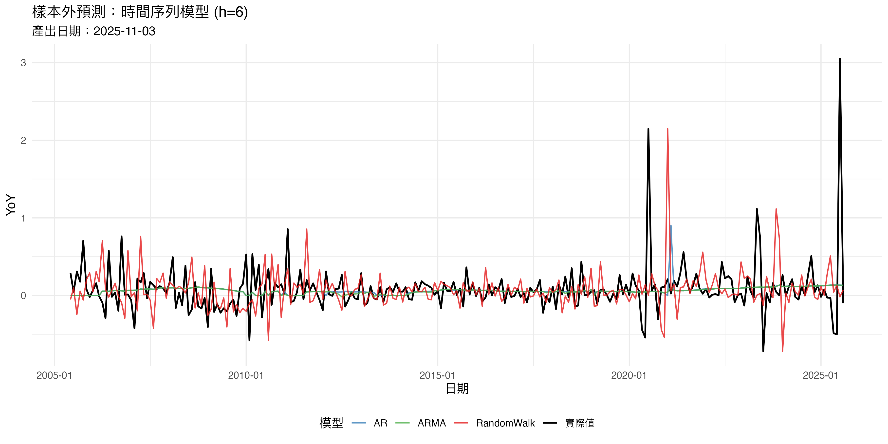
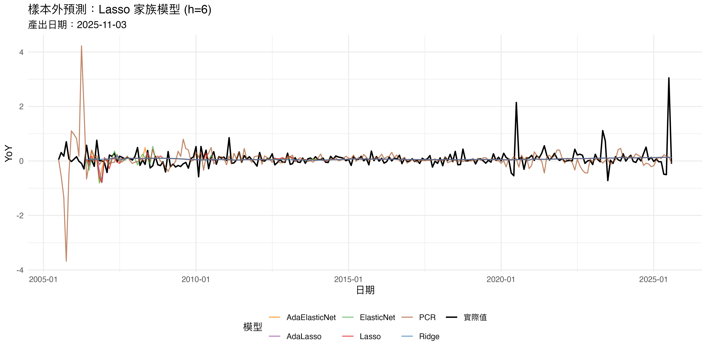
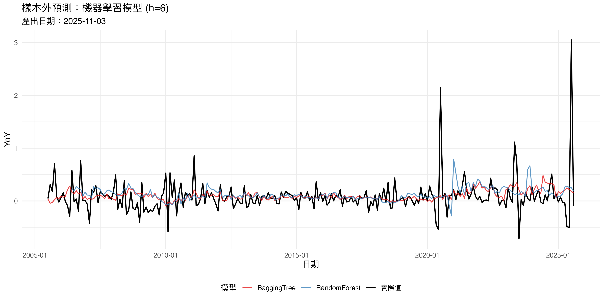
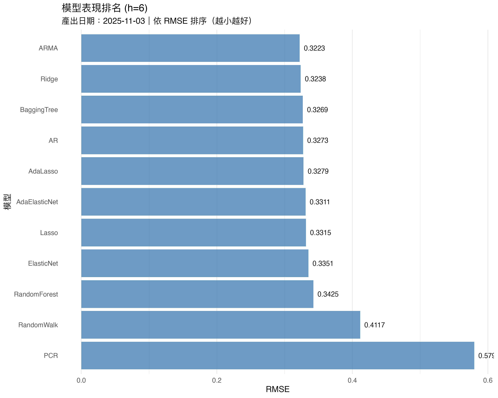
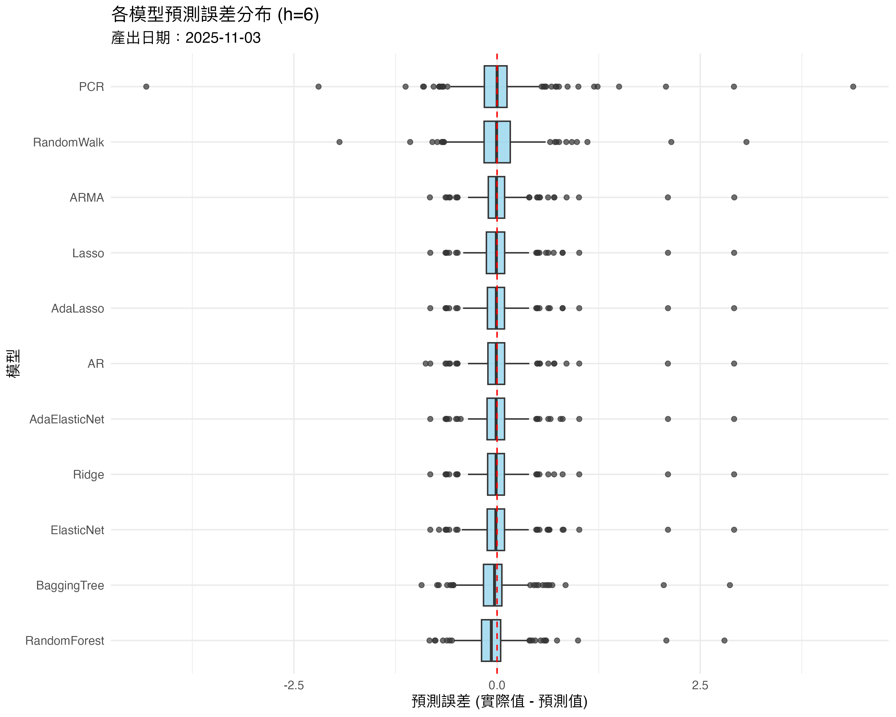
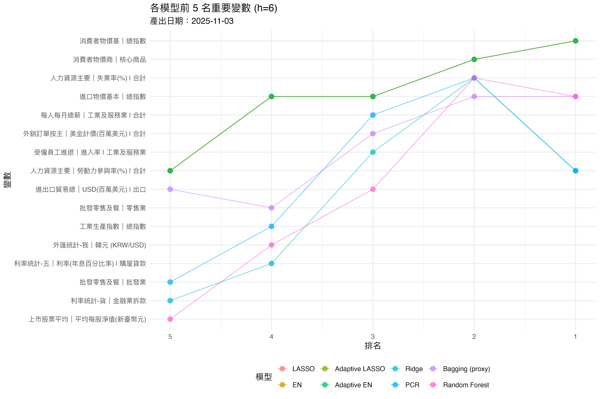
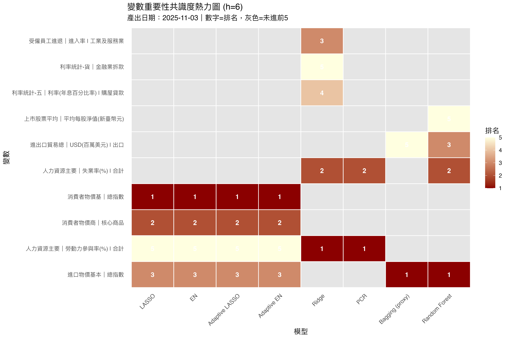

# 稅收預測系統使用手冊

## 系統概述

本系統為稅收預測的完整分析流程，涵蓋資料前處理、模型估計、樣本外預測評估、未來預測（nowcast）、變數重要性分析與視覺化。系統支援多種預測方法，包括時間序列模型（AR、ARMA）、迴歸收縮方法（Lasso、Ridge、Elastic
Net）、以及機器學習模型（Bagging Tree、Random Forest）。

### 主要功能

-   **多模型預測**：同時執行 11 種預測模型，自動比較表現
-   **滾動視窗驗證**：使用 rolling window 評估樣本外預測能力
-   **多期預測**：支援 h=1 到 h=12 的不同預測期間
-   **變數重要性分析**：識別對預測最有貢獻的經濟變數
-   **自動視覺化**：產生完整的圖表與報表

### 系統架構

```         
專案目錄/
├── data/
│   ├── wide_tab.xlsx       # 主要資料檔
│   └── meta_tab.xlsx       # 變數說明檔
├── outputs/
│   ├── h_6/
│   │   ├── results/        # RDS 結果檔
│   │   ├── excel_files/    # Excel 報表
│   │   └── figures/        # 圖表
│   ├── h_2/
│   └── ...
├── 0_setup.R               # 資料準備
├── 1_models_ts.R           # 時間序列模型
├── 2_models_lasso.R        # Lasso 家族模型
├── 3_models_ml.R           # 機器學習模型
├── 4_combine_results.R     # 結果彙整
├── 5_nowcast.R             # 未來預測
├── 6_variable_importance.R # 變數重要性
├── 7_visualize.R           # 視覺化
├── run_all.R               # 主控腳本
├── run_all_13.R            # 批次執行 h=1~3
├── run_all_46.R            # 批次執行 h=4~6
├── run_all_79.R            # 批次執行 h=7~9
└── run_all_1012.R          # 批次執行 h=10~12
```

------------------------------------------------------------------------

## 快速開始

### 前置準備

1.  **安裝 R 套件**（第一次執行時會自動安裝）：
    -   data.table, readxl, lubridate
    -   forecast, glmnet, ipred, ranger
    -   ggplot2, scales, writexl
2.  **準備資料檔**：
    -   `data/wide_tab.xlsx`：寬表格式的月資料，包含時間欄與各變數
    -   `data/meta_tab.xlsx`：變數對照表，包含
        `var_label`、`tcode`、`dataset_title`、`series_name`

### 執行單一預測期間（以 h=1 為例）

``` r
# 設定預測期間
h <- 1

# 執行完整流程
source("run_all.R")
```

執行完成後，結果會儲存在 `outputs/h_6/` 目錄下。

### 批次執行多個預測期間

``` r
# 執行 h=1 到 h=3
source("run_all_13.R")

# 執行 h=4 到 h=6
source("run_all_46.R")

# 執行 h=7 到 h=9
source("run_all_79.R")

# 執行 h=10 到 h=12
source("run_all_1012.R")
```

------------------------------------------------------------------------

## 輸出結果說明

### Excel 報表

執行完成後會在 `outputs/h_{h}/excel_files/` 產生以下檔案：

#### 1. 樣本外預測結果

**檔案名稱**：`forecast_outputs_h{h}_YYYYMMDD.xlsx`

包含兩個工作表：

-   **model_metrics_rmse_mae_mad**：各模型的預測誤差指標
    -   `model`：模型名稱
    -   `RMSE`：均方根誤差（Root Mean Squared Error）
    -   `MAE`：平均絕對誤差（Mean Absolute Error）
    -   `MAD`：中位數絕對誤差（Median Absolute Deviation）
-   **oos_predictions_by_model**：每個時間點的實際值與預測值
    -   `date`：預測時點
    -   `model`：模型名稱
    -   `y`：實際的 YoY 成長率
    -   `yhat`：預測的 YoY 成長率

#### 2. 未來預測

**檔案名稱**：`nowcast_h62_h{h}_YYYYMMDD.xlsx`

包含未來 12 個月的預測：

-   `date`：預測月份
-   `horizon`：預測期數（1\~12）
-   `model`：模型名稱
-   `yhat_yoy`：預測的 YoY 成長率
-   `base_value_t12`：12 個月前的稅收基期值
-   `actual_forecast`：還原後的實際稅收預測值

#### 3. 變數重要性

**檔案名稱**：`var_importance_BASE_top8_h{h}_SUM_YYYYMMDD.xlsx`

包含四個工作表：

-   **var_name_dictionary_BASE**：變數名稱對照表
-   **BASE_top_CODE**：各模型前 8 名重要變數（代碼）
-   **BASE_top_SHORT**：各模型前 8 名重要變數（短名稱）
-   **BASE_top_LONG**：各模型前 8 名重要變數（完整名稱）

### 視覺化圖表

執行完成後會在 `outputs/h_{h}/figures/` 產生以下圖表：

#### 1. 樣本外預測走勢圖



**這張圖在看什麼？** - 黑色實線是實際的 YoY 成長率 -
彩色線條是各模型的預測值 - 可以目視比較哪個模型最貼近實際值



**這張圖在看什麼？** - 比較 Lasso、Ridge、Elastic Net
等收縮方法的預測表現 - 通常 Adaptive 方法（紫色、橘色）會有較好的表現



**這張圖在看什麼？** - 比較 Bagging Tree 和 Random Forest 的預測 -
樹模型通常能捕捉非線性關係

#### 2. 模型排名圖



**這張圖在看什麼？** - 橫軸是 RMSE，數值越小表示預測越準確 -
模型由上到下依 RMSE 排序 - 最上方的模型在該預測期間表現最佳 -
右側數字是確切的 RMSE 值，可直接比較

#### 3. 預測誤差分布



**這張圖在看什麼？** - 箱型圖顯示每個模型的預測誤差分布 -
紅色虛線是零誤差線 - 箱子越窄表示預測越穩定 -
中位數越接近零表示預測越不偏

#### 4. 未來預測路徑


**這張圖在看什麼？** - 深藍線是所有模型預測的平均值 - 深藍區域是 25-75
百分位數（一半模型落在此區間） - 淺藍區域是最小到最大值的範圍 -
可以看出未來 12 個月的 YoY 趨勢與不確定性


**這張圖在看什麼？** - 類似上圖，但是還原成實際稅收金額 -
深綠線是平均預測，區域代表預測範圍 - 可直接看出未來稅收的絕對水準

#### 5. 變數重要性分析



**這張圖在看什麼？** - 顯示各模型認為最重要的前 5 個變數 -
連線代表同一變數在不同模型的排名 -
如果某變數出現在多個模型，表示它確實重要



**這張圖在看什麼？** - 顏色越深紅表示排名越前面（越重要） -
灰色表示該變數未進入該模型的前 5 名 -
可以快速看出哪些變數獲得最多模型的「認同」

------------------------------------------------------------------------

## 參數設定與調整

### 核心參數（在 `0_setup.R` 中設定）

``` r
# ---- 參數設定 ----
excel_path    <- file.path(local_path, "data", "wide_tab.xlsx")
sheet_name    <- 1
time_col      <- "ym"
target_col    <- "A100101010_1"
h             <- 1        # 預測期間
train_len     <- 60       # 訓練視窗長度
p_max         <- 6        # 最大落遲期數
var_exp_cut   <- 0.95     # PCR 累積解釋變異門檻
elastic_alpha <- 0.5      # Elastic Net 混合比例
adapt_gamma   <- 1.0      # Adaptive Lasso 權重指數
```

#### 參數說明

**1. h（預測期間）**

``` r
h <- 1   # 預測下 1 個月
h <- 3   # 預測下 3 個月
h <- 12  # 預測下 12 個月
```

-   這是最重要的參數，決定你要預測多遠的未來
-   h=1 通常最準確，h 越大越困難
-   建議：先跑 h=1 確認系統正常，再跑其他期間

**2. train_len（訓練視窗長度）**

``` r
train_len <- 60   # 用過去 5 年（60 個月）的資料訓練
train_len <- 120  # 用過去 10 年的資料訓練
```

-   控制每次估計模型時使用多少歷史資料
-   太短：模型不穩定，容易過度配適（overfitting）
-   太長：可能包含太舊的資訊，不符合當前經濟結構
-   建議：月資料用 60-120，季資料用 40-60

**3. p_max（最大落遲期數）**

``` r
p_max <- 6   # 每個變數最多用到 6 期落遲
p_max <- 12  # 每個變數最多用到 12 期落遲
```

-   決定自變數的落遲項數量
-   例如 `p_max=6` 表示每個變數 X 會產生 X_L1, X_L2, ..., X_L6
-   太小：可能遺漏重要的動態關係
-   太大：特徵數量暴增，容易過度配適
-   建議：月資料用 6-12，季資料用 4-8

**4. var_exp_cut（PCR 解釋變異門檻）**

``` r
var_exp_cut <- 0.95   # 主成份要解釋 95% 的變異
var_exp_cut <- 0.90   # 主成份要解釋 90% 的變異
```

-   PCR（主成份迴歸）會保留多少資訊
-   0.95 表示主成份累積解釋 95% 的總變異
-   越高保留越多資訊，但也保留更多雜訊
-   建議：0.90-0.95 之間

**5. elastic_alpha（Elastic Net 混合比例）**

``` r
elastic_alpha <- 0.5   # Lasso 和 Ridge 各半
elastic_alpha <- 0.8   # 偏向 Lasso
elastic_alpha <- 0.2   # 偏向 Ridge
```

-   Elastic Net 是 Lasso 和 Ridge 的混合
-   alpha=1 是純 Lasso（會把不重要的係數縮減到 0）
-   alpha=0 是純 Ridge（所有係數都保留但縮小）
-   alpha=0.5 是兩者折衷
-   建議：0.5 是安全的預設值

**6. adapt_gamma（Adaptive Lasso 權重指數）**

``` r
adapt_gamma <- 1.0   # 標準 Adaptive Lasso
adapt_gamma <- 2.0   # 更激進的變數選擇
```

-   Adaptive Lasso 會先用 Ridge 估計係數，再根據係數大小調整懲罰
-   gamma 越大，對小係數的懲罰越重
-   建議：1.0 是標準設定

### 進階參數調整範例

#### 範例 1：增加訓練視窗與落遲期數

如果你的資料夠長，想讓模型看更多歷史資訊：

``` r
# 修改 0_setup.R
train_len <- 120  # 改用 10 年資料
p_max <- 12       # 增加到 12 期落遲

# 重新執行
source("0_setup.R")
source("run_all.R")
```

#### 範例 2：調整 Elastic Net 偏向 Lasso

如果你希望模型做更多變數選擇（把不重要的變數係數設為 0）：

``` r
# 修改 0_setup.R
elastic_alpha <- 0.8  # 偏向 Lasso

# 重新執行
source("0_setup.R")
source("2_models_lasso.R")
source("4_combine_results.R")
```

#### 範例 3：只執行特定模型

如果你只想跑 Lasso 家族和時間序列，不想跑機器學習（較慢）：

``` r
# 修改 run_all.R
run_modules <- list(
  setup      = TRUE,
  ts         = TRUE,
  lasso      = TRUE,
  ml         = FALSE,  # 關閉機器學習
  combine    = TRUE,
  nowcast    = TRUE,
  importance = TRUE,
  visualize  = TRUE
)

# 執行
source("run_all.R")
```

### 變數重要性分析參數（在 `6_variable_importance.R` 中）

``` r
# ---- 參數設定 ----
k_top           <- 8       # 顯示前幾名重要變數
agg_method      <- "sum"   # 彙總方法："sum" 或 "max"
short_max_chars <- 28      # 短名稱最大字元數
```

#### 參數說明

**1. k_top（顯示排名數量）**

``` r
k_top <- 5   # 只看前 5 名
k_top <- 10  # 看前 10 名
```

-   控制輸出表格顯示幾個最重要的變數
-   建議：5-10 之間，太多會難以解讀

**2. agg_method（彙總方法）**

``` r
agg_method <- "sum"  # 把所有落遲項的重要性加總
agg_method <- "max"  # 只取最重要的那一期落遲
```

-   因為每個變數有多個落遲項（如 X_L1, X_L2,
    ...），需要彙總到原始變數層級
-   "sum"：如果 X 的多個落遲項都重要，加總後排名會靠前
-   "max"：只看 X 的哪一期落遲最重要
-   建議：用 "sum" 可以看整體貢獻

------------------------------------------------------------------------

## 模型方法說明

### 時間序列模型

這些模型只用目標變數本身的歷史值進行預測。

**1. Random Walk**

```         
y_t+h = y_t
```

-   最簡單的預測：未來值等於現在值
-   常用作基準模型（benchmark）
-   如果其他模型連 Random Walk 都贏不了，通常表示預測很困難

**2. AR（自我迴歸）**

```         
y_t = c + φ_1*y_t-1 + φ_2*y_t-2 + ... + ε_t
```

-   用過去的 y 值來預測未來
-   系統會自動選擇最佳落遲期數
-   適合有明顯自我相關的時間序列

**3. ARMA（自我迴歸移動平均）**

```         
y_t = c + φ_1*y_t-1 + ... + θ_1*ε_t-1 + ... + ε_t
```

-   同時考慮過去的 y 值與預測誤差
-   比 AR 更有彈性，但也更容易過度配適
-   系統會用 AIC 準則自動選擇最佳模型

### Lasso 家族

這些模型使用其他經濟變數（的落遲項）來預測目標變數。

**1. Lasso**

-   會自動做變數選擇，把不重要的係數縮減到 0
-   適合特徵數量遠多於樣本數的情況
-   結果容易解釋（只保留重要變數）

**2. Ridge**

-   會縮小所有係數，但不會設為 0
-   比 Lasso 更穩定，但無法做變數選擇
-   適合所有變數都有一點貢獻的情況

**3. Elastic Net**

-   Lasso 和 Ridge 的混合
-   兼具變數選擇與穩定性
-   `elastic_alpha` 控制混合比例

**4. Adaptive Lasso**

-   兩階段估計：先用 Ridge 估計，再用估計結果調整 Lasso 的懲罰
-   對真正重要的變數懲罰較輕，對不重要的變數懲罰較重
-   理論上有較好的變數選擇性質

**5. Adaptive Elastic Net**

-   Adaptive Lasso 的 Elastic Net 版本
-   結合 Elastic Net 的穩定性與 Adaptive 的變數選擇能力

**6. PCR（主成份迴歸）**

-   先對所有自變數做主成份分析（PCA），再用主成份做迴歸
-   可以處理自變數之間的共線性問題
-   `var_exp_cut` 控制保留多少資訊

### 機器學習模型

這些模型可以自動捕捉非線性關係。

**1. Bagging Tree**

-   重複抽樣訓練多個決策樹，再平均預測結果
-   比單一決策樹更穩定
-   可以處理非線性與交互作用

**2. Random Forest**

-   Bagging Tree 的改良版
-   每棵樹只隨機使用一部分特徵
-   通常是表現最好的機器學習方法之一
-   缺點是運算較慢，且較難解釋

------------------------------------------------------------------------

## 結果解讀指南

### 如何判斷模型表現

**1. 看 RMSE 排名**

```         
模型            RMSE    MAE     MAD
AdaElasticNet   0.0245  0.0189  0.0165
RandomForest    0.0256  0.0198  0.0172
Lasso           0.0267  0.0205  0.0181
...
```

-   RMSE 越小越好
-   如果前幾名都是 Adaptive 方法，表示變數選擇很重要
-   如果 Random Forest 表現很好，可能有非線性關係

**2. 看預測走勢圖**

-   如果某模型的預測線總是比實際值高（或低），表示有系統性偏誤
-   如果預測線波動很大，表示模型不穩定
-   理想的預測應該緊密跟隨實際值，但不要完全重疊（那可能是 overfitting）

**3. 看誤差分布**

-   箱型圖的中位數應該接近 0（不偏）
-   箱子應該窄（穩定）
-   不應該有太多極端值（outliers）

### 如何解讀變數重要性

**1. 看共識度**

如果某變數在多個模型都排名靠前，表示它確實重要：

```         
排序  Lasso    Ridge    Random Forest
1     失業率   失業率   失業率
2     CPI      工業生產  CPI
3     利率     CPI      利率
```

這裡「失業率」獲得三個模型一致認同，是最重要的變數。

**2. 看模型差異**

-   Lasso/Adaptive Lasso：選出的變數通常是「不可或缺」的
-   Ridge：選出的變數是「總體貢獻大」的
-   Random Forest：選出的變數可能涉及「非線性效果」或「交互作用」

**3. 注意落遲期**

```         
變數              重要性
工業生產 (L1)     0.15
工業生產 (L3)     0.12
失業率 (L2)       0.10
```

如果工業生產的 L1 和 L3 都重要，表示它對稅收有持續影響。

### 常見問題診斷

**Q: 為什麼 Random Walk 表現最好？**

A: 這通常表示目標變數很難預測（接近隨機漫步）。可能原因： -
資料雜訊太大 - 預測期間 h 太長 - 自變數與目標變數關係不強

建議：縮短 h，或檢查資料品質。

**Q: 為什麼所有模型的 RMSE 都很接近？**

A: 表示不同模型捕捉到類似的資訊。這不一定是壞事，代表結果很穩健。

**Q: 為什麼機器學習模型沒有明顯優勢？**

A: 可能是線性模型已經足夠，或是： - 樣本數太少，樹模型容易過度配適 -
經濟變數之間的關係本來就偏線性 - 可以嘗試增加 `train_len`

**Q: 變數重要性分析中，為什麼有些模型沒有選到任何變數？**

A: 可能是該模型在這次訓練中失敗（例如數值問題），系統會自動跳過並標記為
NA。

------------------------------------------------------------------------

## 進階應用

### 比較不同預測期間

執行完 h=1 到 h=12 後，可以比較不同期間的模型表現：

``` r
# 讀取所有結果
results <- list()
for(h in 1:12) {
  path <- sprintf("outputs/h_%d/excel_files/model_metrics_h%d_*.xlsx", h, h)
  file <- list.files(dirname(path), pattern=basename(path), full.names=TRUE)[1]
  results[[h]] <- readxl::read_excel(file)
  results[[h]]$h <- h
}

# 合併
all_results <- do.call(rbind, results)

# 繪圖
library(ggplot2)
ggplot(all_results, aes(x=h, y=RMSE, color=model)) +
  geom_line() +
  geom_point() +
  labs(title="不同預測期間的模型表現",
       x="預測期間 (h)", y="RMSE") +
  theme_minimal()
```

### 組合預測

可以將多個模型的預測結果加權平均，通常會比單一模型更穩健：

``` r
# 讀取樣本外預測
library(data.table)
pred <- as.data.table(readxl::read_excel(
  "outputs/h_6/excel_files/forecast_outputs_h6_20251103.xlsx",
  sheet="oos_predictions_by_model"
))

# 計算簡單平均
ensemble <- pred[, .(
  y = y[1],
  yhat_ensemble = mean(yhat, na.rm=TRUE)
), by=date]

# 計算 RMSE
sqrt(mean((ensemble$y - ensemble$yhat_ensemble)^2, na.rm=TRUE))
```

### 自訂變數轉換

如果你想修改變數的轉換方式（例如改用季節差分），可以編輯 `0_setup.R`：

``` r
# 在 meta_tab.xlsx 中設定 tcode：
# 1 = 不轉換
# 2 = 一階差分
# 3 = 二階差分
# 4 = log
# 5 = log 一階差分
# 6 = log 二階差分
# 7 = 成長率的差分

# 或是在程式中直接修改特定變數：
transform_variable <- function(x, tcode) {
  if(tcode == 1) return(x)
  else if(tcode == 2) return(c(NA, diff(x)))
  # ... 其他轉換
  else if(tcode == 8) {
    # 自訂：季節差分
    return(x - lag(x, 12))
  }
  else return(x)
}
```

------------------------------------------------------------------------

## 疑難排解

### 常見錯誤訊息

**錯誤：找不到 results 資料夾**

```         
Error: 找不到 outputs/h_6/results，請先跑對應的 0_setup.R
```

解決方法：

``` r
h <- 1
source("0_setup.R")
```

**錯誤：資料太短**

```         
Error: 資料太短，請降低 train_len 或確認資料長度
```

解決方法：檢查 `train_len` 和 `h` 的設定，確保
`train_len + h < 資料總長度`。

**警告：某些模型失敗**

```         
Warning: cv.glmnet 執行失敗
```

這通常不影響整體分析，系統會自動跳過失敗的模型。可能原因： -
訓練樣本中有太多 NA - 某個視窗的資料變異太小 - 數值計算問題

如果頻繁出現，可以： 1. 增加 `train_len` 2. 檢查原始資料是否有異常值 3.
調整 `p_max`（減少特徵數量）

### 效能優化

**1. 減少執行時間**

如果執行太慢，可以：

``` r
# 減少 rolling window 的次數（增加步長）
# 修改各 models 檔案中的：
idx_train_end <- seq(from = train_len, to = n - h, by = 3)  # 改為每 3 個月評估一次
```

``` r
# 減少機器學習的樹數量
# 修改 3_models_ml.R：
fit_rf <- ranger::ranger(y ~ ., data=tr_df,
                         num.trees=200,  # 原本是 500
                         ...)
```

``` r
# 只跑必要的模型
# 修改 run_all.R：
run_modules <- list(
  setup      = TRUE,
  ts         = TRUE,
  lasso      = TRUE,
  ml         = FALSE,  # 關閉最慢的機器學習
  combine    = TRUE,
  nowcast    = FALSE,  # 如果不需要未來預測也可關閉
  importance = TRUE,
  visualize  = TRUE
)
```

**2. 平行運算**

如果要同時跑多個 h 值，不要用 for loop，改用平行運算：

``` r
# 安裝套件
install.packages("parallel")

# 平行執行
library(parallel)
cl <- makeCluster(4)  # 使用 4 個核心

parLapply(cl, 1:12, function(h_val) {
  h <- h_val
  source("run_all.R")
})

stopCluster(cl)
```

注意：平行運算會同時佔用大量記憶體，請依電腦配置調整核心數。

### 資料格式要求

**wide_tab.xlsx 格式**

```         
ym          A100101010_1  X1       X2       ...
2010-M1     1000000      5.2      102.5
2010-M2     1050000      5.1      103.1
...
```

要求： - 必須有時間欄（格式：YYYY-Mm，例如 2025-M1） -
必須有目標變數欄 - 其他欄位是自變數 - 不可有完全重複的欄位名稱

**meta_tab.xlsx 格式**

```         
var_label    tcode  dataset_title      series_name
X1           5      國民所得統計       工業生產指數
X2           2      勞動統計           失業率
...
```

要求： - `var_label`：必須與 wide_tab.xlsx 的欄位名稱一致 -
`tcode`：變數轉換代碼（1-7） - `dataset_title`：資料集名稱（用於顯示） -
`series_name`：變數名稱（用於顯示）

### 記憶體管理

如果遇到記憶體不足：

``` r
# 在每個 script 開頭加上
options(future.globals.maxSize = 2000 * 1024^2)  # 增加到 2GB

# 減少落遲期數
p_max <- 4  # 原本是 6

# 減少訓練視窗
train_len <- 48  # 原本是 60
```

------------------------------------------------------------------------

## 系統更新與維護

### 新增模型

如果要加入新的預測方法，可以參考現有的 script 結構：

``` r
# 新增 3_models_YOUR_METHOD.R

library(data.table)
# library(your_package)

# 載入資料
if (!exists("h")) stop("沒有設定 h")
results_dir <- file.path("outputs", paste0("h_", h), "results")
setup <- readRDS(file.path(results_dir, "prepared_data.rds"))

# 準備變數
dat <- setup$dat
target_col <- setup$target_col
# ...

# Rolling 預測
collect <- list()
for (i in seq_along(idx_train_end)){
  # ... 訓練與預測
  collect[[i]] <- data.table(
    date = te_row[[time_col]],
    model = "YOUR_METHOD",
    y = y_te,
    yhat = your_prediction
  )
}

# 儲存
roll_result <- rbindlist(collect)
score_result <- roll_result[, .(
  RMSE = sqrt(mean((y - yhat)^2, na.rm=TRUE)),
  MAE  = mean(abs(y - yhat), na.rm=TRUE),
  MAD  = median(abs(y - yhat), na.rm=TRUE)
), by=model]

saveRDS(list(roll=roll_result, score=score_result), 
        file.path(results_dir, "roll_YOUR_METHOD.rds"))
```

然後在 `4_combine_results.R` 中加入：

``` r
if(file.path(results_dir, "roll_YOUR_METHOD.rds") %in% existing_files){
  res_your <- readRDS(file.path(results_dir, "roll_YOUR_METHOD.rds"))
  all_rolls$roll_your <- res_your$roll
  all_scores$score_your <- res_your$score
  cat("✓ YOUR_METHOD 模型\n")
}
```

### 客製化視覺化

如果要修改圖表樣式，編輯 `7_visualize.R`：

``` r
# 修改顏色
scale_color_manual(values = c(
  "實際值" = "black",
  "RandomWalk" = "#your_color",
  ...
))

# 修改圖表主題
theme_minimal(base_size=14) +  # 增大字體
theme(
  plot.title = element_text(face="bold", size=16),
  legend.position = "right"  # 改變圖例位置
)

# 修改圖片大小
ggsave(..., width=14, height=7, dpi=400)  # 更高解析度
```

### 批次匯出報告

如果要一次產生所有 h 的摘要報告：

``` r
# 建立 summary_all_h.R
library(data.table)
library(writexl)

summary_list <- list()

for(h in 1:12) {
  excel_dir <- file.path("outputs", paste0("h_", h), "excel_files")
  files <- list.files(excel_dir, pattern="^model_metrics.*\\.xlsx$", full.names=TRUE)
  
  if(length(files) > 0) {
    dt <- as.data.table(readxl::read_excel(files[1]))
    dt$h <- h
    summary_list[[h]] <- dt
  }
}

summary_all <- rbindlist(summary_list, fill=TRUE)
setorder(summary_all, h, RMSE)

# 輸出
writexl::write_xlsx(summary_all, "outputs/summary_all_horizons.xlsx")

# 找出每個 h 的最佳模型
best_models <- summary_all[, .SD[which.min(RMSE)], by=h]
print(best_models)
```

------------------------------------------------------------------------

## 理論背景與參考資料

### 評估指標說明

**RMSE（Root Mean Squared Error）**

$RMSE = \sqrt{\frac{1}{n}\sum_{i=1}^{n}(y_i - \hat{y}_i)^2}$

-   對大誤差給予較重的懲罰
-   單位與原始變數相同
-   最常用的預測誤差指標

**MAE（Mean Absolute Error）**

$MAE = \frac{1}{n}\sum_{i=1}^{n}|y_i - \hat{y}_i|$

-   對所有誤差一視同仁
-   對極端值較不敏感
-   容易解釋（平均誤差多少）

**MAD（Median Absolute Deviation）**

$MAD = median(|y_i - \hat{y}_i|)$

-   使用中位數，對極端值非常穩健
-   適合有 outliers 的情況

### 變數轉換的經濟意義

系統使用的 tcode 對應關係：

| tcode | 轉換方式     | 適用情況             | 例子          |
|-------|--------------|----------------------|---------------|
| 1     | 不轉換       | 已經是成長率或百分比 | 失業率、利率  |
| 2     | 一階差分     | 去除趨勢（水準）     | 房價指數      |
| 3     | 二階差分     | 去除趨勢（斜率）     | 加速度型變數  |
| 4     | log          | 處理指數成長         | 股價指數      |
| 5     | log 一階差分 | 近似成長率           | GDP、工業生產 |
| 6     | log 二階差分 | 成長率的變化         | 加速/減速     |
| 7     | 成長率的差分 | \-                   | \-            |

**為什麼要轉換？**

時間序列的基本假設是「定態」（stationary），意思是： -
平均數不隨時間改變 - 變異數不隨時間改變 - 自我相關只跟時間間隔有關

如果原始變數有趨勢（如 GDP
持續成長），就不符合定態假設，迴歸結果會有偽迴歸（spurious
regression）問題。透過差分或 log 轉換，可以讓資料變成定態。

### Direct vs. Iterated 預測策略

系統在 Lasso 家族與機器學習使用 **direct strategy**：

```         
h=1: 用 X_t 預測 y_t+1
h=2: 用 X_t 預測 y_t+2
h=3: 用 X_t 預測 y_t+3
```

優點： - 每個期間都有專屬模型 - 不會累積預測誤差

缺點： - 需要估計多個模型 - 長期預測的訓練樣本較少

時間序列模型使用 **iterated strategy**：

```         
h=1: 預測 y_t+1
h=2: 用預測的 y_t+1 再預測 y_t+2
h=3: 用預測的 y_t+2 再預測 y_t+3
```

優點： - 只需要一個模型 - 保持時間序列的動態結構

缺點： - 誤差會累積 - 長期預測較不準確


------------------------------------------------------------------------

## 附錄：完整範例

### 從頭開始的完整流程

假設你是第一次使用這個系統：

**步驟 1：準備資料**

確保 `data/` 資料夾有以下檔案： - `wide_tab.xlsx` - `meta_tab.xlsx`

**步驟 2：設定工作目錄**

``` r
# 在 R 或 RStudio 中
setwd("your_project_path")  # 改成你的專案路徑
```

**步驟 3：執行第一次預測（h=1）**

``` r
h <- 1
source("run_all.R")
```

等待執行完成（約 5-15 分鐘，視資料大小而定）。

**步驟 4：檢查結果**

``` r
# 查看模型排名
library(readxl)
result <- read_excel("outputs/h_6/excel_files/forecast_outputs_h6_20251103.xlsx", 
                     sheet="model_metrics_rmse_mae_mad")
print(result)

# 查看圖表
# 直接開啟 outputs/h_6/figures/ 資料夾
```

**步驟 5：執行其他預測期間**

``` r
# 方法 1：一次跑一個
h <- 2
source("run_all.R")

h <- 3
source("run_all.R")

# 方法 2：批次執行
source("run_all_13.R")   # h=1~3
source("run_all_46.R")   # h=4~6
source("run_all_79.R")   # h=7~9
source("run_all_1012.R") # h=10~12
```

**步驟 6：比較結果**

``` r
# 讀取所有 h 的最佳模型
library(data.table)

best_models <- data.table()
for(h in 1:12) {
  path <- sprintf("outputs/h_%d/excel_files/", h)
  files <- list.files(path, pattern="^model_metrics.*\\.xlsx$", full.names=TRUE)
  if(length(files) > 0) {
    dt <- as.data.table(read_excel(files[1]))
    dt$h <- h
    best <- dt[which.min(RMSE)]
    best_models <- rbind(best_models, best)
  }
}

print(best_models[order(h)])
```

### 常見使用情境

**情境 1：每月更新預測**

當新的月資料進來時：

``` r
# 1. 更新 wide_tab.xlsx（加入最新一個月的資料）
# 2. 重新執行
h <- 1  # 或你需要的預測期間
source("run_all.R")

# 3. 比較新舊預測
# 可以保留舊的 outputs/ 資料夾，改名為 outputs_YYYYMM/
```

**情境 2：測試新的自變數**

想加入新的經濟指標：

``` r
# 1. 在 wide_tab.xlsx 加入新欄位
# 2. 在 meta_tab.xlsx 加入對應的 var_label、tcode、名稱
# 3. 重新執行
h <- 1
source("0_setup.R")  # 重新處理資料
source("run_all.R")

# 4. 查看變數重要性分析，看新變數是否有用
```

**情境 3：調整模型參數**

想嘗試不同的參數設定：

``` r
# 1. 備份原始設定
# cp 0_setup.R 0_setup_backup.R

# 2. 修改參數
# 編輯 0_setup.R，例如改 train_len <- 120

# 3. 執行並比較
h <- 1
source("run_all.R")

# 4. 記錄結果，決定是否採用新參數
```

**情境 4：只產生特定輸出**

假設你只需要更新視覺化圖表：

``` r
h <- 1

# 不重跑模型，只重做圖表
run_modules <- list(
  setup      = FALSE,
  ts         = FALSE,
  lasso      = FALSE,
  ml         = FALSE,
  combine    = FALSE,
  nowcast    = FALSE,
  importance = FALSE,
  visualize  = TRUE  # 只跑視覺化
)

source("run_all.R")
```

------------------------------------------------------------------------

## 聯絡與支援

### 回報問題

如果遇到錯誤或有疑問，請提供以下資訊：

1.  R 版本（`R.version.string`）
2.  套件版本（`packageVersion("glmnet")` 等）
3.  完整的錯誤訊息
4.  使用的參數設定
5.  資料基本資訊（列數、欄數、時間範圍）

### 系統需求

-   R \>= 4.0.0
-   記憶體：至少 4GB（建議 8GB 以上）
-   硬碟空間：至少 1GB（用於輸出檔案）
-   建議使用 RStudio

### 版本記錄

-   v1.0 (2024-11)：初始版本
    -   支援 11 種預測模型
    -   完整的視覺化與報表
    -   變數重要性分析

------------------------------------------------------------------------

## 快速參考

### 常用指令

``` r
# 執行單一 h
h <- 1
source("run_all.R")

# 批次執行
source("run_all_13.R")

# 只跑特定模組
run_modules$ml <- FALSE  # 關閉機器學習
source("run_all.R")

# 檢視結果
list.files("outputs/h_6/excel_files/")
list.files("outputs/h_6/figures/")
```

### 重要檔案位置

```         
outputs/h_{h}/
├── excel_files/
│   ├── forecast_outputs_h{h}_YYYYMMDD.xlsx    # 主要結果
│   ├── nowcast_h62_h{h}_YYYYMMDD.xlsx         # 未來預測
│   └── var_importance_BASE_top8_h{h}_SUM_YYYYMMDD.xlsx  # 變數重要性
└── figures/
    ├── model_ranking_h{h}_YYYYMMDD.png        # 模型排名
    ├── oos_timeseries_h{h}_YYYYMMDD.png       # 時間序列預測
    ├── forecast_paths_yoy_h{h}_YYYYMMDD.png   # 未來預測路徑
    └── importance_heatmap_h{h}_YYYYMMDD.png   # 重要性熱力圖
```

### 關鍵參數速查

| 參數          | 位置                    | 預設值 | 說明                 |
|---------------|-------------------------|--------|----------------------|
| h             | 環境變數                | 1      | 預測期間             |
| train_len     | 0_setup.R               | 60     | 訓練視窗長度（月）   |
| p_max         | 0_setup.R               | 6      | 最大落遲期數         |
| elastic_alpha | 0_setup.R               | 0.5    | Elastic Net 混合比例 |
| var_exp_cut   | 0_setup.R               | 0.95   | PCR 解釋變異門檻     |
| k_top         | 6_variable_importance.R | 8      | 顯示前幾名重要變數   |

------------------------------------------------------------------------

**文件版本**：v1.0\
**最後更新**：2024-11\
**適用系統版本**：稅收預測系統 v1.0
