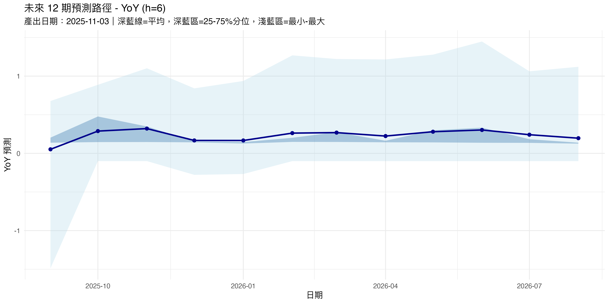
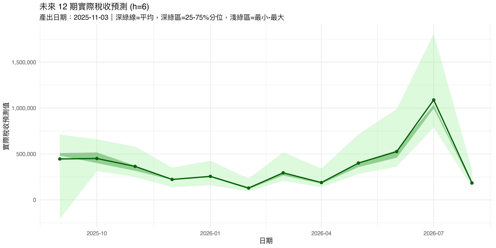

# 0_setup.R 說明文件

這份文件用來解釋 `0_setup.R` 在專案裡的角色與執行邏輯。\
主要步驟包含：

1.  套件載入與安裝\
2.  路徑與參數設定\
3.  輸出目錄建立\
4.  讀檔與時間轉換\
5.  目標變數 YoY 化\
6.  依 tcode 轉換變數\
7.  PCA 因子計算\
8.  建立 lag 特徵\
9.  儲存結果

讀者可以把這份文件當成「這個專案前處理程式碼的操作說明書」。

------------------------------------------------------------------------

## 1. 套件與基本路徑設定

``` r
pkgs <- c("data.table","readxl","lubridate")
ins <- pkgs[!pkgs %in% installed.packages()[,"Package"]]
if(length(ins)) install.packages(ins, repos="https://cloud.r-project.org")
invisible(lapply(pkgs, library, character.only=TRUE))
local_path <- getwd()
```

說明：

-   `pkgs`：列出這支程式會用到的套件。
    -   `data.table`：加速資料處理，用中括號 `[]` 搭配特殊語法。\
    -   `readxl`：用來讀取 Excel 檔。\
    -   `lubridate`：處理日期用，這裡後面雖然沒有直接呼叫，但保留以防之後要用。\
-   `installed.packages()`：回傳目前電腦已安裝的套件。
    -   `pkgs[!pkgs %in% installed.packages()[,"Package"]]`：找出還沒安裝的套件名稱。\
-   `install.packages(ins, ...)`：如果有缺的套件就從 CRAN 安裝。\
-   `lapply(pkgs, library, character.only=TRUE)`：把 `pkgs` 裡的每一個套件都 `library()` 一次。
    -   外面包 `invisible()` 是為了不要顯示多餘訊息。\
-   `getwd()`：取得目前工作目錄，存到 `local_path`，之後組檔案路徑都用這個當根。

------------------------------------------------------------------------

## 2. 參數與檔案路徑設定

``` r
excel_path    <- file.path(local_path, "data", "wide_tab.xlsx")
sheet_name    <- 1
time_col      <- "ym"
target_col    <- "A100101010_1"

if (!exists("h")) {
  h <- 1
}
cat(">>> 現在的 h =", h, "\n")

train_len     <- 60
p_max         <- 6
var_exp_cut   <- 0.95
elastic_alpha <- 0.5
adapt_gamma   <- 1.0

meta_path <- file.path(local_path, "data", "meta_tab.xlsx")
```

說明：

-   `file.path()`：用來組出不同作業系統都安全的路徑。
    -   這裡把 `local_path` 加上 `data/wide_tab.xlsx`，得到主要資料檔的位置。\
    -   `meta_path` 則是 meta 資料（裡面有 tcode 設定）的路徑。\
-   `time_col`：時間欄位名稱，之後會用這個字串去抓對應欄位。\
-   `target_col`：要預測的目標變數欄位名稱。\
-   `exists("h")`：檢查環境裡有沒有已經設定好的 `h`。
    -   如果外部沒事先指定，就預設 `h <- 1`。\
-   `cat()`：簡單印出目前的 `h` 值，用來確認有沒有設錯。\
-   `train_len`：每次 rolling 預測時，用多少期資料當訓練集。\
-   `p_max`：lag 特徵要做到第幾期（1 到 p_max）。\
-   `var_exp_cut`、`elastic_alpha`、`adapt_gamma`：後面 PCA 和 Elastic Net 相關模型會用到的參數，這裡先集中設定。

------------------------------------------------------------------------

## 3. 建立 h 專屬輸出資料夾

``` r
output_root <- file.path(local_path, "outputs", sprintf("h_%d", h))
dir.create(output_root, recursive = TRUE, showWarnings = FALSE)

results_dir <- file.path(output_root, "results")
dir.create(results_dir, showWarnings = FALSE)

cat(sprintf("\n=== 輸出目錄設定 ===\n"))
cat(sprintf("h = %d\n", h))
cat(sprintf("輸出根目錄: %s\n\n", output_root))
```

說明：

-   `sprintf("h_%d", h)`：把目前的 `h` 拼成字串，例如 `h_1`、`h_2`。\
-   `output_root`：這次預測（指定的 h）所有輸出檔案的根目錄。\
-   `dir.create(..., recursive=TRUE)`：如果中間資料夾不存在就一路建立。\
-   `results_dir`：專門拿來放處理好資料、模型結果等的子資料夾。\
-   這一段的重點是：每一個 `h` 都會有自己的輸出路徑，避免不同預測期的結果互相覆蓋。

------------------------------------------------------------------------

## 4. 讀取原始資料並標準化欄位名稱

``` r
raw <- as.data.table(readxl::read_excel(excel_path, sheet = sheet_name))
setnames(raw, old=names(raw), new=make.names(names(raw)))
time_col   <- make.names(time_col)
target_col <- make.names(target_col)

stopifnot(time_col %in% names(raw), target_col %in% names(raw))
```

說明：

-   `readxl::read_excel()`：從 Excel 檔讀進一個 data.frame。\
-   `as.data.table()`：轉成 data.table 物件，之後可以用 data.table 語法。\
-   `setnames()`：一次改變所有欄位名稱。
    -   `make.names()`：把欄位名稱轉成 R 合法的名稱（把空白、特殊字元改掉）。\
-   `time_col <- make.names(time_col)`：讓時間欄名稱也套用同樣規則，之後才對得起來。\
-   `stopifnot()`：檢查時間欄和目標變數欄是不是都存在於 `raw`，如果不存在會直接報錯停止。

------------------------------------------------------------------------

## 5. 解析時間欄位 (YYYY-Mm 格式)

``` r
parse_ym_M <- function(v){
  v  <- as.character(v)
  yr <- as.integer(sub("^(\\d{4})-M.*$", "\\1", v))
  mm <- as.integer(sub("^\\d{4}-M(\\d{1,2})$", "\\1", v))
  if (any(is.na(yr)) || any(is.na(mm))) {
    stop("時間欄位必須長得像 '2025-M1' 或 '2025-M11'")
  }
  as.Date(sprintf("%04d-%02d-01", yr, mm))
}

raw[, (time_col) := parse_ym_M(get(time_col))]
data.table::setorderv(raw, cols = time_col, order = 1L, na.last = TRUE)
```

說明：

-   這段的目標是把像 `2025-M1` 這種格式轉成真正的日期。\
-   `sub("^(\\d{4})-M.*$", "\\1", v)`：用正規表示式抓出前四碼的年份。\
-   `sub("^\\d{4}-M(\\d{1,2})$", "\\1", v)`：抓出 M 後面的月份數字。\
-   如果年份或月份抓不出來，就 `stop()` 給警告。\
-   `as.Date(sprintf("%04d-%02d-01", yr, mm))`：把年與月組成「當月一號」的日期物件。\
-   `raw[, (time_col) := parse_ym_M(get(time_col))]`：
    -   `get(time_col)`：用欄位名稱字串抓出對應欄。\
    -   `:=` 是 data.table 的「就地新增或覆寫欄位」語法。\
-   `setorderv()`：依照時間欄位排序，確保資料的時間順序是由舊到新。

------------------------------------------------------------------------

## 6. 目標變數轉為 YoY 成長率

``` r
raw[, paste0(target_col, "_original") := get(target_col)]

raw[, (target_col) := {
  original <- get(paste0(target_col, "_original"))
  lag12 <- shift(original, n=12, type="lag")
  (original - lag12) / lag12
}]
```

說明：

-   `paste0(target_col, "_original")`：產生一個新的欄位名稱，存原始水準值。\
-   第一行用 `:=` 在 `raw` 裡新增一個欄位，把原來的目標變數備份起來。\
-   `shift(original, n=12, type="lag")`：
    -   來自 `data.table`，用來做落後值。\
    -   這裡是計算 12 期前的值，也就是去年同期。\
-   `(original - lag12) / lag12`：算 YoY 成長率。\
-   第二個 `raw[, (target_col) := {...}]`：
    -   把原本的目標變數欄位覆寫為 YoY 成長率。\
    -   之後模型直接用這個成長率當目標。

------------------------------------------------------------------------

## 7. 根據 tcode 轉換變數

``` r
meta_data <- readxl::read_excel(meta_path)
tcode_mapping <- setNames(meta_data$tcode, meta_data$var_label)

transform_variable <- function(x, tcode) {
  if(tcode == 1) return(x)
  else if(tcode == 2) return(c(NA, diff(x)))
  else if(tcode == 3) {
    temp <- c(NA, diff(x))
    return(c(NA, diff(temp, na.rm=FALSE)))
  }
  else if(tcode == 4) return(log(x))
  else if(tcode == 5) return(c(NA, diff(log(x))))
  else if(tcode == 6) {
    temp <- c(NA, diff(log(x)))
    return(c(NA, diff(temp, na.rm=FALSE)))
  }
  else if(tcode == 7) {
    pct <- x / c(NA, x[-length(x)]) - 1
    return(c(NA, diff(pct)))
  }
  else return(x)
}

transform_vars <- setdiff(names(raw), c(time_col, target_col, paste0(target_col, "_original")))

for(v in transform_vars) {
  tcode <- tcode_mapping[v]
  if(!is.na(tcode)) {
    raw[[v]] <- transform_variable(raw[[v]], tcode)
  }
}
```

說明：

-   `meta_tab.xlsx` 裡面記錄每個變數的 `tcode`，代表要做什麼轉換，例如：
    -   1：原始值不動。\
    -   2：一次差分。\
    -   4：取 log。\
    -   5：log 後再差分，等等。\
-   `setNames(meta_data$tcode, meta_data$var_label)`：
    -   建立一個「變數名稱 → tcode」的對照表。\
-   `diff()`：計算相鄰觀測值的差。\
-   `log()`：自然對數。\
-   `x / c(NA, x[-length(x)]) - 1`：計算成長率（本期 / 前一期 − 1）。\
-   `transform_vars`：要做轉換的變數集合，排除時間欄、目標欄、目標原始欄。\
-   `raw[[v]] <- transform_variable(raw[[v]], tcode)`：
    -   用 list 取欄位的寫法，等同於 `raw[, v := ...]`，這裡寫法較直觀。\
-   這一段的目的，是把各變數轉成比較「平穩」的型態，減少趨勢或單根問題。

------------------------------------------------------------------------

## 8. PCA 因子計算

``` r
numeric_vars <- setdiff(names(raw), c(time_col, target_col, paste0(target_col, "_original")))
numeric_data <- as.data.frame(raw[, ..numeric_vars])

complete_rows <- complete.cases(numeric_data)
clean_data <- numeric_data[complete_rows, ]

scaled_data <- scale(clean_data)
pca_result <- prcomp(scaled_data, center=FALSE, scale.=FALSE)
factors <- pca_result$x[, 1:4]

factor_df <- as.data.frame(matrix(NA, nrow=nrow(raw), ncol=4))
names(factor_df) <- paste0("Factor", 1:4)
factor_df[complete_rows, ] <- factors

raw <- cbind(raw, factor_df)
```

說明：

-   `numeric_vars`：挑出要拿來做 PCA 的欄位，排除時間、目標與目標原始值。\
-   `raw[, ..numeric_vars]`：data.table 語法，選取多個欄位。前面的 `..` 是引用外部變數。\
-   `complete.cases()`：回傳哪些列沒有 NA。\
-   `clean_data`：只有完整列的資料，用來做 PCA。\
-   `scale(clean_data)`：把每個變數做標準化（減平均除標準差），避免變數尺度差太多。\
-   `prcomp()`：R 內建的主成分分析函數。
    -   回傳的 `x` 是每一個樣本在各主成分上的分數。\
-   `pca_result$x[, 1:4]`：取前四個主成分分數，當成共同因子。\
-   為了讓原始資料筆數不變，用一個 `factor_df` 先填 NA，再把有完整資料的列放入因子分數。\
-   最後 `cbind()` 把因子欄位接回 `raw`，多出 `Factor1` 到 `Factor4`。

------------------------------------------------------------------------

## 9. 建立 lag 特徵

``` r
num_vars <- setdiff(names(raw), c(time_col, paste0(target_col, "_original")))

make_lags <- function(dt, vars, pmax){
  dt <- copy(dt)
  for (v in vars){
    for (L in 1:pmax){
      dt[, paste0(v,"_L",L) := shift(get(v), n=L, type="lag")]
    }
  }
  dt
}

dat <- make_lags(raw, vars=num_vars, pmax=p_max)
lag_vars <- grep("(_L[0-9]+)$", names(dat), value=TRUE)
```

說明：

-   `num_vars`：要做 lag 的變數集合，這裡排除時間欄和目標原始值，其餘全部建立 lag。\
-   `copy(dt)`：`data.table::copy`，避免在函數裡修改到原本的物件。\
-   雙層迴圈邏輯：
    -   外圈跑每一個變數 `v`。\
    -   內圈跑 `L = 1` 到 `pmax`，為每個變數建立第 1–pmax 期的落後值。\
-   `shift(get(v), n=L, type="lag")`：
    -   取變數 `v` 的第 L 期落後。\
    -   用 `paste0(v,"_L",L)` 當新欄位名稱，例如 `x_L1`。\
-   `grep("(_L[0-9]+)$", names(dat), value=TRUE)`：抓出所有名字結尾長得像 `_L1`, `_L2`, ... 的欄位，存成 `lag_vars`。
    -   之後建模時，如果要「只用 lag 特徵」，可以直接用這個向量。

------------------------------------------------------------------------

## 10. 儲存處理後的資料

``` r
saveRDS(list(
  dat = dat,
  target_col = target_col,
  target_col_original = paste0(target_col, "_original"),
  time_col = time_col,
  lag_vars = lag_vars,
  train_len = train_len,
  h = h,
  var_exp_cut = var_exp_cut,
  elastic_alpha = elastic_alpha,
  adapt_gamma = adapt_gamma,
  output_root = output_root,
  results_dir = results_dir
), file.path(results_dir, "prepared_data.rds"))
```

說明：

-   `saveRDS()`：把一個 R 物件存成單一檔案。
    -   這裡把所有需要的東西打包成一個 list：
        -   前處理後的資料 `dat`\
        -   目標欄名、時間欄名\
        -   lag 特徵名稱 `lag_vars`\
        -   rolling 長度、h、以及一些模型相關參數\
        -   這次執行的輸出路徑\
-   檔名固定是 `prepared_data.rds`，放在當前 h 的 `results_dir` 底下。\
-   後續的模型腳本只需要 `readRDS()` 這個檔案，就能拿到一模一樣的資料與設定，不用再重跑前處理。

------------------------------------------------------------------------

## 小結

`0_setup.R` 的角色，是把原始的 Excel 資料轉成「可直接建模」的格式，並且把關鍵設定一起打包起來。

只要成功產生 `prepared_data.rds`，後面的程式就可以從同樣的起點開始做預測與評估，確保整個專案的流程是可重現、可維護的。

# 1_models_ts.R 說明文件


```r
## ============================================================================
## 1_models_ts.R - 時間序列模型 (RandomWalk / AR / ARMA)
## ============================================================================

library(data.table)
library(forecast)
```

說明：

1. 腳本開頭的註解區塊  
   - 這三行 `## ===` 與中間那行文字只是「說明這支檔案用途」的註解，實際執行時不會對結果有任何影響。  
   - 這支檔案的功能是建立「時間序列模型」，包含 Random Walk、AR、ARMA 三種模型。

2. `library(data.table)`  
   - 功能：載入 `data.table` 套件。  
   - `data.table` 是一個加強版的 `data.frame`，適合處理大筆資料，提供更快的運算與簡潔的語法。  
   - 執行結果：載入後，就可以使用 `data.table()` 函數建立資料表，也可以用 `DT[ , .( ) , by= ]` 這種語法做群組計算。

3. `library(forecast)`  
   - 功能：載入 `forecast` 套件。  
   - `forecast` 提供時間序列分析與預測的常用工具，例如 `auto.arima()` 自動選 ARIMA 模型，`forecast()` 用來產生未來預測值。  
   - 執行結果：載入後，就可以使用 `forecast::auto.arima()`、`forecast::forecast()` 等函數來幫我們對時間序列做模型估計與預測。


## 2. 載入準備好的資料與檢查環境設定

這一節負責：
1. 印出提示訊息。
2. 檢查外部是否有設定 `h`。
3. 根據 `h` 找到對應的結果資料夾。
4. 從該資料夾讀取事先準備好的資料物件 `prepared_data.rds`。

```r
h <- 6
## ---- 載入準備好的資料 ----
cat("載入資料...\n")


## 用目前的 h 找資料夾（平行跑才不會亂）
if (!exists("h")) stop("沒有設定 h，請在外面給 h 再跑這支 script。")

results_dir <- file.path("outputs", paste0("h_", h), "results")
if (!dir.exists(results_dir)) stop(paste("找不到", results_dir, "，請先跑對應的 0_setup.R。"))


setup <- readRDS(file.path(results_dir, "prepared_data.rds"))
dat <- setup$dat
target_col <- setup$target_col
time_col <- setup$time_col
train_len <- setup$train_len
h <- setup$h
output_root <- setup$output_root

cat(sprintf("使用 h = %d 的資料\n", h))
```

說明：

1. `cat("載入資料...\n")`  
   - 功能：在 R console 中印出文字訊息。  
   - `cat()` 會直接輸出字串，`\n` 代表換行。  
   - 執行結果：執行時會顯示  
     `載入資料...`  
     讓使用者知道程式正在進行載入資料的動作。

2. `if (!exists("h")) stop("沒有設定 h，請在外面給 h 再跑這支 script。")`  
   - `exists("h")`  
     - 功能：檢查環境中是否已經存在名為 `h` 的物件。  
     - 執行結果：回傳 `TRUE` 或 `FALSE`。  
   - `!exists("h")`  
     - 功能：邏輯「非」，如果 `h` 不存在就會是 `TRUE`。  
   - `stop("...")`  
     - 功能：立刻中止程式，並顯示錯誤訊息。  
     - 執行結果：如果沒有預先設定 `h`，腳本會直接停止執行，避免後面步驟用到錯誤的資料。

3. `results_dir <- file.path("outputs", paste0("h_", h), "results")`  
   - `paste0("h_", h)`  
     - 功能：把字串 `"h_"` 和 `h` 的數值接在一起，例如 `h = 3` 時會變成 `"h_3"`。  
   - `file.path(...)`  
     - 功能：依照作業系統自動組合路徑。例如在 Windows 會用 `\`，在 macOS/Linux 會用 `/`。  
   - 執行結果：`results_dir` 會是一個像 `outputs/h_3/results` 的資料夾路徑，用來存放這個 `h` 對應的結果。

4. `if (!dir.exists(results_dir)) stop(...)`  
   - `dir.exists(results_dir)`  
     - 功能：檢查指定的資料夾是否存在。  
   - 如果資料夾不存在，用 `stop()` 中止程式，並提示要先跑 `0_setup.R`。  
   - 執行結果：可以避免在資料還沒準備好時就進行建模。

5. `setup <- readRDS(file.path(results_dir, "prepared_data.rds"))`  
   - `readRDS()`  
     - 功能：讀取 R 以 `.rds` 格式儲存的單一物件。  
     - `file.path(results_dir, "prepared_data.rds")` 則是組合出檔案路徑。  
   - 執行結果：`setup` 會是一個 R 物件（通常是 list），裡面包含事先整理好的資料與設定。

6. `dat <- setup$dat` 等一系列 `$` 取欄位的動作  
   - 功能：從 `setup` 這個 list 物件裡把各個元素取出來：  
     - `dat`：完整的時間序列資料表（通常是 `data.table` 或 `data.frame`）。  
     - `target_col`：目標變數（要預測的欄位）名稱（字串）。  
     - `time_col`：時間欄位名稱（字串）。  
     - `train_len`：每次 rolling 訓練集的長度（觀測值個數）。  
     - `h`：預測步數（forecast horizon），這裡又再用 `setup$h` 覆寫，確保跟準備資料時一致。  
     - `output_root`：輸出檔案的根目錄。  
   - 執行結果：後面所有預測與儲存結果都會用這些物件。

7. `cat(sprintf("使用 h = %d 的資料\n", h))`  
   - `sprintf("使用 h = %d 的資料\n", h)`  
     - 功能：把 `h` 的數值帶入字串中的 `%d` 位置（整數格式）。  
   - `cat(...)` 會把這個格式化後的字串印出來。  
   - 執行結果：例如 `h = 3` 時，console 會顯示  
     `使用 h = 3 的資料`  
     幫助確認目前是在處理哪一個預測步數。


## 3. 定義誤差評估指標函數

這一節定義三個常用的預測誤差指標：RMSE、MAE、MAD。  
它們都是「函數」，後面會直接套用在誤差向量上。

```r
## ---- 指標函數 ----
rmse <- function(e) sqrt(mean(e^2, na.rm=TRUE))
mae  <- function(e) mean(abs(e), na.rm=TRUE)
madm <- function(e) median(abs(e), na.rm=TRUE)
```

說明：

1. 自訂函數的基本形式  
   - `rmse <- function(e) { ... }` 這種寫法是建立一個新函數，名稱叫 `rmse`，輸入參數是 `e`。  
   - 這裡使用的是「單行函數」寫法，省略 `{}`，R 會把右邊的運算結果當成回傳值。

2. `rmse <- function(e) sqrt(mean(e^2, na.rm=TRUE))`  
   - 目標：計算 Root Mean Squared Error (RMSE)。  
   - `e^2`：把向量 `e` 中的每個值平方。  
   - `mean(..., na.rm=TRUE)`：計算平均值，`na.rm=TRUE` 代表忽略 `NA`。  
   - `sqrt(...)`：對平均平方誤差取平方根。  
   - 執行結果：`rmse(e)` 會回傳一個數值，代表這組誤差的 RMSE 大小。

3. `mae  <- function(e) mean(abs(e), na.rm=TRUE)`  
   - 目標：計算 Mean Absolute Error (MAE)。  
   - `abs(e)`：取絕對值。  
   - 然後對這些絕對值取平均（同樣忽略 `NA`）。  
   - 執行結果：`mae(e)` 會回傳誤差絕對值的平均值。

4. `madm <- function(e) median(abs(e), na.rm=TRUE)`  
   - 目標：計算 Median Absolute Deviation from the Median（這裡簡寫為 MAD）。  
   - 一樣先取絕對值，再算中位數 `median()`。  
   - 執行結果：`madm(e)` 會回傳一個數值，對離群值比較不敏感。


## 4. 建立 Rolling 預測的索引與進度條

這一節會：
1. 算出資料筆數。
2. 決定每次訓練集的結尾位置。
3. 建立用來收集結果的 list。
4. 建立進度條，讓長時間迴圈執行時比較有感。

```r
## ---- Rolling 預測 ----
cat("\n開始 Rolling 預測...\n")
n <- nrow(dat)
idx_train_end <- seq(from = train_len, to = n - h, by = 1)
if (!length(idx_train_end)) stop("資料太短，請降低 train_len 或確認資料長度。")

collect_ts <- list()
pb <- txtProgressBar(min = 0, max = length(idx_train_end), style = 3)
```

說明：

1. `cat("\n開始 Rolling 預測...\n")`  
   - 功能：先印一行空白（前面的 `\n`），再印「開始 Rolling 預測...」，再換行。  
   - 執行結果：在 console 給使用者一個明確的階段提示。

2. `n <- nrow(dat)`  
   - `nrow(dat)`  
     - 功能：取得資料表 `dat` 的列數，也就是時間序列的觀測筆數。  
   - 執行結果：`n` 是一個整數，代表全部可用的時間點數量。

3. `idx_train_end <- seq(from = train_len, to = n - h, by = 1)`  
   - `seq(from = A, to = B, by = 1)`  
     - 功能：產生一個等差數列，從 `A` 到 `B`，每次加 1。  
   - 這裡的意思是：  
     - 每個訓練集的「結尾 index」從 `train_len` 開始，一直到 `n - h`。  
     - `n - h` 是因為最後要留 `h` 期給未來預測。  
   - 執行結果：`idx_train_end` 是一個整數向量，裡面每一個值都代表一個 rolling 訓練樣本的結尾位置。

4. `if (!length(idx_train_end)) stop("資料太短，請降低 train_len 或確認資料長度。")`  
   - `length(idx_train_end)` 回傳向量長度，如果是 0 代表完全產生不出訓練區間。  
   - `!length(idx_train_end)` 就是在檢查「長度是否為 0」。  
   - 如果是 0，用 `stop()` 終止程式，避免後面的迴圈出錯。  
   - 執行結果：資料太短時會直接報錯，提醒調整 `train_len` 或檢查資料。

5. `collect_ts <- list()`  
   - 功能：建立一個空的 list，用來存放每一步 rolling 預測的結果。  
   - 為什麼用 list？因為每次的結果都是一個小 `data.table`，list 很適合先一筆一筆放，最後再合併。

6. `pb <- txtProgressBar(min = 0, max = length(idx_train_end), style = 3)`  
   - `txtProgressBar()`  
     - 功能：建立文字介面的進度條物件。  
     - `min` 與 `max` 設定進度範圍，這裡是 0 到「總共要跑幾次 rolling」。  
     - `style = 3` 代表顯示形式（style 3 是常見的百分比進度條）。  
   - 執行結果：`pb` 是一個進度條物件，之後搭配 `setTxtProgressBar(pb, i)` 就可以更新進度顯示。


## 5. 主要 Rolling 預測迴圈與三種時間序列模型

這一節是整支腳本的核心：  
用一個 `for` 迴圈，針對每個訓練結尾位置做以下事情：

1. 切出訓練集與測試點。  
2. 建立三種模型：Random Walk、AR、ARMA。  
3. 預測第 `h` 期的值。  
4. 把每一步的預測結果整理成 `data.table`，存入 `collect_ts`。  
5. 更新進度條。

```r
for (i in seq_along(idx_train_end)){
  te <- idx_train_end[i]
  train_idx <- (te - train_len + 1):te
  test_idx  <- te + h

  tr     <- dat[train_idx]
  te_row <- dat[test_idx]

  y_tr <- tr[[target_col]]
  y_te <- te_row[[target_col]]

  ## Random Walk
  yhat_rw <- tail(y_tr, 1)

  ## AR
  fit_ar <- tryCatch(
    forecast::auto.arima(y_tr, d=0, max.q=0, seasonal=FALSE,
                        stepwise=TRUE, approximation=TRUE), 
    error=function(e) NULL
  )
  yhat_ar <- tryCatch(
    as.numeric(forecast::forecast(fit_ar, h=h)$mean[h]), 
    error=function(e) yhat_rw
  )

  ## ARMA
  fit_arma <- tryCatch(
    forecast::auto.arima(y_tr, d=0, seasonal=FALSE,
                        stepwise=TRUE, approximation=TRUE), 
    error=function(e) NULL
  )
  yhat_arma <- tryCatch(
    as.numeric(forecast::forecast(fit_arma, h=h)$mean[h]), 
    error=function(e) yhat_rw
  )

  collect_ts[[length(collect_ts)+1]] <- data.table(
    date = te_row[[time_col]],
    model = c("RandomWalk","AR","ARMA"),
    y     = y_te,
    yhat  = c(yhat_rw, yhat_ar, yhat_arma)
  )
  
  setTxtProgressBar(pb, i)
}
close(pb)
```

說明（逐段解析）：

1. `for (i in seq_along(idx_train_end)) { ... }`  
   - `for` 迴圈：重複執行同一段程式碼，用來逐步處理每一個訓練結尾位置。  
   - `seq_along(idx_train_end)`：產生 `1, 2, ..., length(idx_train_end)` 的整數序列。  
   - `i`：目前在處理第幾個 rolling 切點。  
   - 執行結果：這段程式碼會從第一個訓練結尾位置一路跑到最後一個，對每個時間點都做一次「訓練 + 預測」。

2. `te <- idx_train_end[i]`  
   - `te`（train end）：這一輪訓練集的最後一列 index。  
   - 執行結果：後面會用 `te` 來決定訓練與預測的位置。

3. `train_idx <- (te - train_len + 1):te`  
   - 功能：產生訓練集的列 index 範圍。  
   - 範圍從「結尾往前推 `train_len - 1` 列」到 `te`。  
   - 執行結果：`train_idx` 會是一串整數，例如 `101:200`，用來切 `dat`。

4. `test_idx  <- te + h`  
   - 功能：計算要預測的那個時間點 index，是在結尾後面第 `h` 期。  
   - 執行結果：`test_idx` 就是這一輪要拿來計算預測誤差的目標位置。

5. `tr <- dat[train_idx]`、`te_row <- dat[test_idx]`  
   - `dat[train_idx]`  
     - 功能：從原始資料 `dat` 切出訓練集子集。  
   - `dat[test_idx]`  
     - 功能：取出測試那一列（這個時間點的真實值）。  
   - 執行結果：  
     - `tr`：訓練資料（多列）。  
     - `te_row`：測試資料（一列）。

6. `y_tr <- tr[[target_col]]`、`y_te <- te_row[[target_col]]`  
   - `[[ ]]` 取欄位：  
     - 功能：以欄位名稱（儲存在 `target_col` 這個字串）取出對應欄位。  
   - `y_tr`：訓練期間的目標變數向量。  
   - `y_te`：測試那一列的真實目標值（單一數值）。

7. Random Walk 模型：`yhat_rw <- tail(y_tr, 1)`  
   - `tail(y_tr, 1)`  
     - 功能：取出 `y_tr` 最後一個觀測值。  
   - Random Walk 的預測邏輯：下一期的預測值等於上一期的實際值。  
   - 執行結果：`yhat_rw` 是這一輪的 Random Walk 預測值。

8. AR 模型：`fit_ar <- tryCatch(...)`  
   - `forecast::auto.arima(...)`  
     - 功能：自動選擇 ARIMA 模型的階數與參數。  
     - 這裡設定 `d=0, max.q=0, seasonal=FALSE`，所以只會選擇「純 AR 模型」(沒有差分、沒有 MA 部分、也沒有季節性)。  
     - `stepwise=TRUE`、`approximation=TRUE`：讓搜索過程比較快。  
   - `tryCatch(..., error=function(e) NULL)`  
     - 功能：如果 `auto.arima()` 在某一輪失敗（例如資料特性不適合），就不要讓整個程式崩潰，而是回傳 `NULL`。  
   - 執行結果：  
     - `fit_ar` 要嘛是一個 AR 模型物件，要嘛是 `NULL`（代表估計失敗）。

9. AR 預測值：`yhat_ar <- tryCatch(as.numeric(forecast::forecast(fit_ar, h=h)$mean[h]), error=function(e) yhat_rw)`  
   - `forecast::forecast(fit_ar, h=h)`  
     - 功能：從已經估計好的 AR 模型 `fit_ar` 產生往後 `h` 期的預測。  
   - `$mean[h]`  
     - 功能：取出第 `h` 期的預測平均值。  
   - `as.numeric(...)`  
     - 功能：確保結果是單一的數值型態。  
   - 外層 `tryCatch(..., error=function(e) yhat_rw)`  
     - 如果預測過程出錯（例如 `fit_ar` 是 `NULL`），就 fallback 回 Random Walk 的預測值 `yhat_rw`。  
   - 執行結果：`yhat_ar` 永遠會有一個數值（即使模型失敗，也會用 `yhat_rw` 代替）。

10. ARMA 模型與預測：`fit_arma` 與 `yhat_arma`  
    - `fit_arma <- tryCatch(forecast::auto.arima(y_tr, d=0, seasonal=FALSE, ...), ...)`  
      - 這次只固定 `d=0`、`seasonal=FALSE`，但 `max.q` 沒有限制，所以允許 `p` 和 `q` 同時大於 0，也就是一般的 ARMA。  
    - `yhat_arma <- tryCatch(as.numeric(forecast::forecast(fit_arma, h=h)$mean[h]), error=function(e) yhat_rw)`  
      - 和 AR 的流程相同，只是用 ARMA 模型。  
      - 出錯時同樣退回 Random Walk 預測值。  
    - 執行結果：`yhat_arma` 是 ARMA 模型在第 `h` 期的預測值。

11. 結果存入 `collect_ts`：  

    ```r
    collect_ts[[length(collect_ts)+1]] <- data.table(
      date = te_row[[time_col]],
      model = c("RandomWalk","AR","ARMA"),
      y     = y_te,
      yhat  = c(yhat_rw, yhat_ar, yhat_arma)
    )
    ```

    - `length(collect_ts) + 1`  
      - 功能：在 list 的最後再加一個新元素。  
    - `data.table(...)`  
      - 功能：建立一個 `data.table`，欄位說明：  
        - `date`：這次預測對應的時間點（從 `te_row` 的時間欄位取出）。  
        - `model`：模型名稱（字串向量，三列分別是 RandomWalk、AR、ARMA）。  
        - `y`：真實值（每列一樣，都是 `y_te`）。  
        - `yhat`：對應模型的預測值。  
    - 執行結果：`collect_ts` 會越來越長，每一個元素都包含三種模型在某個時間點的預測結果。

12. 更新進度條：`setTxtProgressBar(pb, i)`  
    - 功能：把進度條 `pb` 的目前值更新為 `i`。  
    - 執行結果：console 上的進度條會跟著迴圈更新，方便監控執行進度。

13. `close(pb)`  
    - 功能：迴圈結束後，把進度條關閉。  
    - 執行結果：進度條停止更新，畫面回到一般輸出。


## 6. 彙整所有 Rolling 結果並計算誤差指標

這一節會：
1. 把 `collect_ts` 裡面一個個 `data.table` 合併成一張大表。  
2. 移除預測值為缺失的資料列。  
3. 用前面定義的 `rmse`、`mae`、`madm` 對每個模型計算指標。  
4. 印出評分表。

```r
## ---- 彙整結果 ----
roll_ts <- rbindlist(collect_ts, fill=TRUE)
roll_ts <- roll_ts[!is.na(yhat)]

cat("\n計算指標...\n")
score_ts <- roll_ts[, .(
  RMSE = rmse(y - yhat),
  MAE  = mae(y - yhat),
  MAD  = madm(y - yhat)
), by=.(model)]

print(score_ts)
```

說明：

1. `roll_ts <- rbindlist(collect_ts, fill=TRUE)`  
   - `rbindlist()`（來自 `data.table` 套件）  
     - 功能：把很多個相同結構的 `data.table` 依列堆疊起來（row bind）。  
     - `fill=TRUE` 代表如果欄位不完全相同，也會自動補上缺少的欄位為 `NA`。  
   - 執行結果：`roll_ts` 會是一個長格式的資料表，每一列是一個時間點與一種模型的預測記錄。

2. `roll_ts <- roll_ts[!is.na(yhat)]`  
   - `is.na(yhat)`：檢查 `yhat` 是否是缺失值。  
   - `!is.na(yhat)`：選出預測值不是缺失的列。  
   - `roll_ts[條件]`：`data.table` 的過濾語法，保留符合條件的列。  
   - 執行結果：確保之後計算指標時，不會用到沒有預測值的紀錄。

3. `cat("\n計算指標...\n")`  
   - 功能：在 console 印出「計算指標...」，前面加一個換行。  
   - 執行結果：讓使用者知道現在進入評估階段。

4. `score_ts <- roll_ts[, .( ... ), by=.(model)]`  

   ```r
   score_ts <- roll_ts[, .(
     RMSE = rmse(y - yhat),
     MAE  = mae(y - yhat),
     MAD  = madm(y - yhat)
   ), by=.(model)]
   ```

   - 這是 `data.table` 的分組運算語法：  
     - `by=.(model)`：依照欄位 `model` 分組（也就是針對每一種模型分別計算指標）。  
     - `.(RMSE = ..., MAE = ..., MAD = ...)`：產生一個新的小表，裡面有三個欄位：RMSE、MAE、MAD。  
   - `y - yhat`：計算每一列的誤差（真實值減預測值）。  
   - `rmse(...)`、`mae(...)`、`madm(...)`：呼叫前面定義好的函數來計算指標。  
   - 執行結果：`score_ts` 是一張摘要表，每一列對應一種模型，欄位顯示該模型的 RMSE／MAE／MAD。

5. `print(score_ts)`  
   - 功能：把 `score_ts` 的內容印在 console。  
   - 執行結果：使用者可以直接在畫面上看到每個模型的預測表現，方便比較。


## 7. 儲存結果到 .rds 檔案

最後這一節會：
1. 把 `roll_ts` 與 `score_ts` 一起存成一個 `.rds` 檔。  
2. 在 console 印出儲存完成的路徑。

```r
## ---- 儲存結果 ----
cat("\n儲存結果...\n")
saveRDS(list(
  roll_ts = roll_ts,
  score_ts = score_ts
), file.path(results_dir, "roll_ts.rds"))

cat(sprintf("時間序列模型完成！結果已儲存至 %s\n", 
            file.path(results_dir, "roll_ts.rds")))
```

說明：

1. `cat("\n儲存結果...\n")`  
   - 功能：印出提示訊息，告訴使用者現在正在儲存檔案。

2. `saveRDS(list(...), file.path(results_dir, "roll_ts.rds"))`  
   - `list(roll_ts = roll_ts, score_ts = score_ts)`  
     - 功能：把兩個物件打包成一個 list，方便一起存檔。  
     - `roll_ts`：每個時間點、每個模型的預測紀錄。  
     - `score_ts`：各模型的彙整指標。  
   - `saveRDS(object, file)`  
     - 功能：把單一 R 物件存成 `.rds` 檔。  
     - 優點：讀取時會完整回復原本的 R 結構。  
   - `file.path(results_dir, "roll_ts.rds")`  
     - 功能：組合出儲存路徑，例如 `outputs/h_3/results/roll_ts.rds`。  
   - 執行結果：在對應的 `results_dir` 內產生一個 `roll_ts.rds` 檔案，裡面包含 `roll_ts` 與 `score_ts`。

3. `cat(sprintf("時間序列模型完成！結果已儲存至 %s\n", file.path(results_dir, "roll_ts.rds")))`  
   - `sprintf("時間序列模型完成！結果已儲存至 %s\n", 路徑)`  
     - 功能：把檔案路徑插入到字串中的 `%s`。  
   - `cat(...)` 會把整句訊息印出來。  
   - 執行結果：console 會顯示類似  
     `時間序列模型完成！結果已儲存至 outputs/h_3/results/roll_ts.rds`  
     方便使用者確認檔案存放位置。


# 2_models_lasso.R - Lasso 家族 (Lasso / Ridge / Elastic Net / Adaptive / PCR)

這份腳本示範如何使用 **Lasso 家族模型** 進行滾動式預測，包括 Lasso、Ridge、Elastic Net、Adaptive Lasso、Adaptive Elastic Net 與主成分回歸 (PCR)。

---

## 1. 套件載入

```r
library(data.table)
library(glmnet)
```

說明：

- `data.table`：提供高效能的資料處理、分組與運算功能，適合大樣本時間序列。  
- `glmnet`：支援 Lasso、Ridge、Elastic Net 等懲罰化迴歸模型，可搭配交叉驗證自動選 λ。  

---

## 2. 載入資料與設定

```r
cat("載入資料...\n")

if (!exists("h")) stop("沒有設定 h，請在外面給 h 再跑這支 script。")

results_dir <- file.path("outputs", paste0("h_", h), "results")
if (!dir.exists(results_dir)) stop(paste("找不到", results_dir, "，請先跑對應的 0_setup.R。"))

setup <- readRDS(file.path(results_dir, "prepared_data.rds"))
dat <- setup$dat
target_col <- setup$target_col
time_col <- setup$time_col
lag_vars <- setup$lag_vars
train_len <- setup$train_len
h <- setup$h
var_exp_cut <- setup$var_exp_cut
elastic_alpha <- setup$elastic_alpha
adapt_gamma <- setup$adapt_gamma
output_root <- setup$output_root

cat(sprintf("使用 h = %d 的資料\n", h))
```

說明：

1. 檢查是否存在 `h` 變數（預測步數）。  
2. 根據 `h` 指定對應資料夾，例如 `outputs/h_3/results`。  
3. 讀取事先由 `0_setup.R` 生成的 `prepared_data.rds`。  
4. 提取模型所需欄位與參數，如 `lag_vars`、`elastic_alpha`、`adapt_gamma` 等。  

---

## 3. 定義誤差衡量函數

```r
rmse <- function(e) sqrt(mean(e^2, na.rm=TRUE))
mae  <- function(e) mean(abs(e), na.rm=TRUE)
madm <- function(e) median(abs(e), na.rm=TRUE)
```

說明：

- `rmse()`：均方根誤差，用於測量整體預測偏差。  
- `mae()`：平均絕對誤差，代表平均偏差大小。  
- `madm()`：絕對誤差中位數，比 MAE 對極端值更穩定。  

---

## 4. 設定 glmnet 共同參數

```r
glmnet_common <- list(
  standardize = TRUE,
  maxit = 1e6,
  nlambda = 80,
  lambda.min.ratio = 1e-3
)
```

說明：

這些參數會在多種模型中共用：  

- `standardize = TRUE`：對變數進行標準化。  
- `maxit = 1e6`：最大迭代次數。  
- `nlambda = 80`：λ 值的取樣數量。  
- `lambda.min.ratio = 1e-3`：最小 λ 與最大 λ 的比例，用於控制懲罰強度範圍。  

---

## 5. Rolling 預測架構

```r
cat("\n開始 Rolling 預測...\n")
n <- nrow(dat)
idx_train_end <- seq(from = train_len, to = n - h, by = 1)
if (!length(idx_train_end)) stop("資料太短，請降低 train_len 或確認資料長度。")

collect_lasso <- list()
pb <- txtProgressBar(min = 0, max = length(idx_train_end), style = 3)
```

說明：

- 建立滾動預測索引，每次使用 `train_len` 筆資料作訓練。  
- `txtProgressBar()`：顯示進度條。  

---

## 6. 主迴圈：模型訓練與預測

```r
for (i in seq_along(idx_train_end)){
  te <- idx_train_end[i]
  train_idx <- (te - train_len + 1):te
  test_idx  <- te + h

  tr     <- dat[train_idx]
  te_row <- dat[test_idx]

  y_tr <- tr[[target_col]]
  y_te <- te_row[[target_col]]

  # 準備特徵矩陣
  X_tr <- as.matrix(tr[, ..lag_vars])
  X_te <- as.matrix(te_row[, ..lag_vars])
  good <- colSums(is.na(X_tr)) == 0
  X_tr <- X_tr[, good, drop=FALSE]
  X_te <- X_te[, good, drop=FALSE]
  
  # 過濾近零變異
  if(ncol(X_tr) > 0){
    sd_ok <- apply(X_tr, 2, sd, na.rm=TRUE) > 1e-8
    X_tr  <- X_tr[, sd_ok, drop=FALSE]
    X_te  <- X_te[, sd_ok, drop=FALSE]
  }

  if (ncol(X_tr) >= 1){
    # Lasso
    fit_lasso <- tryCatch(
      do.call(cv.glmnet, c(list(x=X_tr, y=y_tr, alpha=1), glmnet_common)),
      error=function(e) NULL
    )
    yhat_lasso <- if(!is.null(fit_lasso)) as.numeric(predict(fit_lasso, X_te, s="lambda.1se")) else NA_real_

    # Ridge
    fit_ridge <- tryCatch(
      do.call(cv.glmnet, c(list(x=X_tr, y=y_tr, alpha=0), glmnet_common)),
      error=function(e) NULL
    )
    yhat_ridge <- if(!is.null(fit_ridge)) as.numeric(predict(fit_ridge, X_te, s="lambda.1se")) else NA_real_
    
    # Elastic Net
    fit_en <- tryCatch(
      do.call(cv.glmnet, c(list(x=X_tr, y=y_tr, alpha=elastic_alpha), glmnet_common)),
      error=function(e) NULL
    )
    yhat_en <- if(!is.null(fit_en)) as.numeric(predict(fit_en, X_te, s="lambda.1se")) else NA_real_
    
    # Adaptive 權重（以 Ridge 初估）
    w_al <- tryCatch({
      fit0 <- do.call(cv.glmnet, c(list(x=X_tr, y=y_tr, alpha=0), glmnet_common))
      b0   <- as.numeric(coef(fit0, s="lambda.1se"))[-1]
      w    <- 1/(abs(b0)^adapt_gamma + 1e-6)
      pmin(w, 1e4)
    }, error=function(e) rep(1, ncol(X_tr)))
    
    # Adaptive Lasso
    fit_ada_lasso <- tryCatch(
      do.call(cv.glmnet, c(list(x=X_tr, y=y_tr, alpha=1, penalty.factor=w_al), glmnet_common)),
      error=function(e) NULL
    )
    yhat_ada_lasso <- if(!is.null(fit_ada_lasso)) as.numeric(predict(fit_ada_lasso, X_te, s="lambda.1se")) else NA_real_
    
    # Adaptive Elastic Net
    fit_ada_en <- tryCatch(
      do.call(cv.glmnet, c(list(x=X_tr, y=y_tr, alpha=elastic_alpha, penalty.factor=w_al), glmnet_common)),
      error=function(e) NULL
    )
    yhat_ada_en <- if(!is.null(fit_ada_en)) as.numeric(predict(fit_ada_en, X_te, s="lambda.1se")) else NA_real_

    # PCR
    pca <- tryCatch(prcomp(X_tr, center=TRUE, scale.=TRUE), error=function(e) NULL)
    yhat_pcr <- NA_real_
    if(!is.null(pca)){
      var_exp <- cumsum(pca$sdev^2)/sum(pca$sdev^2)
      k <- which(var_exp >= var_exp_cut)[1]
      Z_tr <- pca$x[,1:k,drop=FALSE]
      Z_te <- scale(X_te, center=pca$center, scale=pca$scale) %*% pca$rotation[,1:k,drop=FALSE]
      fit_pcr <- tryCatch(lm(y_tr ~ Z_tr), error=function(e) NULL)
      if(!is.null(fit_pcr)) yhat_pcr <- as.numeric(cbind(1, Z_te) %*% coef(fit_pcr))
    }

    collect_lasso[[length(collect_lasso)+1]] <- data.table(
      date = te_row[[time_col]],
      model = c("Lasso","Ridge","ElasticNet","AdaLasso","AdaElasticNet","PCR"),
      y     = y_te,
      yhat  = c(yhat_lasso,yhat_ridge,yhat_en,yhat_ada_lasso,yhat_ada_en,yhat_pcr)
    )
  }
  
  setTxtProgressBar(pb, i)
}
close(pb)
```

說明（要點）：

- `cv.glmnet()`：進行交叉驗證選擇最優 λ。  
- `alpha = 1` → Lasso；`alpha = 0` → Ridge；介於 0~1 為 Elastic Net。  
- `penalty.factor`：給不同變數不同懲罰強度，用於 Adaptive Lasso。  
- `prcomp()`：主成分分析，挑出能解釋達指定比例變異的成分（`var_exp_cut`）。  

---

## 7. 彙整結果與評估指標

```r
roll_lasso <- rbindlist(collect_lasso, fill=TRUE)
roll_lasso <- roll_lasso[!is.na(yhat)]

cat("\n計算指標...\n")
score_lasso <- roll_lasso[, .(
  RMSE = rmse(y - yhat),
  MAE  = mae(y - yhat),
  MAD  = madm(y - yhat)
), by=.(model)]

print(score_lasso)
```

說明：

1. 使用 `rbindlist()` 合併所有迴圈結果。  
2. 去除 `yhat` 為 NA 的紀錄。  
3. 依模型計算 RMSE、MAE、MAD。  

---

## 8. 儲存結果

```r
saveRDS(list(
  roll_lasso = roll_lasso,
  score_lasso = score_lasso
), file.path(results_dir, "roll_lasso.rds"))

cat(sprintf("Lasso 家族模型完成！結果已儲存至 %s\n", 
            file.path(results_dir, "roll_lasso.rds")))
```

說明：

- `saveRDS()`：把滾動預測結果與評估指標一併儲存成 `.rds` 檔案。  
- 儲存後會在 console 顯示完成訊息，指出輸出檔路徑。  

---

# 3_models_ml.R 說明文件

## 1. 套件載入與腳本說明

這一節保留原始檔案的標題註解，並載入本腳本會用到的三個套件。

```r
## ============================================================================
## 3_models_ml.R - 機器學習模型 (Bagging Tree / Random Forest)
## ============================================================================

library(data.table)
library(ipred)
library(ranger)
```

說明：

1. 上面三行 `## ===` 是註解，只是說明這支檔案的用途（做機器學習模型：Bagging Tree / Random Forest），不會被 R 執行。  

2. `library(data.table)`  
   - 功能：載入 `data.table` 套件。  
   - 這個套件提供高效能的資料表結構與分組運算語法，例如 `DT[, .(mean_y = mean(y)), by = group]`。  
   - 在這支腳本中，我們會用到 `data.table()`、`rbindlist()` 以及 `DT[...]` 這類語法。  

3. `library(ipred)`  
   - 功能：載入 `ipred` 套件（Improved Prediction）。  
   - 這個套件提供 Bagging（Bootstrap Aggregating）等 ensemble 方法，我們會用到 `bagging()` 來建立 Bagging Tree 模型。  

4. `library(ranger)`  
   - 功能：載入 `ranger` 套件。  
   - `ranger` 是一個高效能的 Random Forest 實作，適合中大型資料集。  
   - 我們會用 `ranger()` 來訓練 Random Forest，並用 `predict()` 取得預測值。  


## 2. 載入準備好的資料與基本設定

這一節：

1. 印出提示訊息。  
2. 檢查 `h` 是否存在。  
3. 根據 `h` 找到對應資料夾並讀入之前準備好的 RDS 檔。  
4. 從中取出要用的資料與參數。

```r
## ---- 載入準備好的資料 ----
cat("載入資料...\n")

## 用目前的 h 找資料夾（平行跑才不會亂）
if (!exists("h")) stop("沒有設定 h，請在外面給 h 再跑這支 script。")

results_dir <- file.path("outputs", paste0("h_", h), "results")
if (!dir.exists(results_dir)) stop(paste("找不到", results_dir, "，請先跑對應的 0_setup.R。"))

setup <- readRDS(file.path(results_dir, "prepared_data.rds"))
dat <- setup$dat
target_col <- setup$target_col
time_col <- setup$time_col
lag_vars <- setup$lag_vars
train_len <- setup$train_len
h <- setup$h
output_root <- setup$output_root

cat(sprintf("使用 h = %d 的資料\n", h))
```

說明：

1. `cat("載入資料...\n")`  
   - `cat()`：在 console 印出字串。  
   - `\n`：換行符號。  
   - 執行結果：畫面顯示「載入資料...」，提示現在在進行資料讀取的步驟。

2. `if (!exists("h")) stop("沒有設定 h，請在外面給 h 再跑這支 script。")`  
   - `exists("h")`：檢查目前環境中是否有名為 `h` 的物件。  
   - `!exists("h")`：如果沒有這個物件就會是 TRUE。  
   - `stop("...")`：立刻中止程式並顯示錯誤訊息。  
   - 執行結果：如果在外部沒有預先設定 `h`（預測步數），腳本會在這裡停住，避免用錯資料。

3. `results_dir <- file.path("outputs", paste0("h_", h), "results")`  
   - `paste0("h_", h)`：把 `"h_"` 和整數 `h` 串在一起，例如 `h = 3` 時得到 `"h_3"`。  
   - `file.path(...)`：依作業系統使用適當分隔符號（`/` 或 `\`）組出路徑。  
   - 執行結果：`results_dir` 類似 `"outputs/h_3/results"`，代表這個 horizon 的結果資料夾。

4. `if (!dir.exists(results_dir)) stop(...)`  
   - `dir.exists(results_dir)`：檢查資料夾是否存在。  
   - 如果不存在，呼叫 `stop()` 提示要先執行 `0_setup.R` 準備好資料。  

5. `setup <- readRDS(file.path(results_dir, "prepared_data.rds"))`  
   - `readRDS()`：讀取 `.rds` 檔案（單一 R 物件）。  
   - `file.path(results_dir, "prepared_data.rds")`：組出檔案路徑。  
   - 執行結果：`setup` 通常是一個 list，裡面包含前處理後的資料與相關設定。

6. 從 `setup` 取出各元素：  

   - `dat <- setup$dat`：完整資料（多半是 `data.table`）。  
   - `target_col <- setup$target_col`：要預測的目標欄位名稱。  
   - `time_col <- setup$time_col`：時間欄位名稱。  
   - `lag_vars <- setup$lag_vars`：特徵（例如 lag 變數）的欄位名稱向量。  
   - `train_len <- setup$train_len`：每次訓練集的長度。  
   - `h <- setup$h`：預測步數，從 `setup` 再取一次，保證一致。  
   - `output_root <- setup$output_root`：輸出檔案根目錄。

7. `cat(sprintf("使用 h = %d 的資料\n", h))`  
   - `sprintf("使用 h = %d 的資料\n", h)`：把 `h` 代入 `%d`，產生一行字串。  
   - `cat()`：印出字串。  
   - 執行結果：例如 `h = 3` 時，會在 console 顯示「使用 h = 3 的資料」。


## 3. 定義預測誤差指標函數

這一節定義 RMSE、MAE、MAD 三個常用指標。

```r
## ---- 指標函數 ----
rmse <- function(e) sqrt(mean(e^2, na.rm=TRUE))
mae  <- function(e) mean(abs(e), na.rm=TRUE)
madm <- function(e) median(abs(e), na.rm=TRUE)
```

說明：

1. 基本函數寫法  
   - `rmse <- function(e) ...`：建立一個名稱為 `rmse` 的函數，輸入參數是誤差向量 `e`。  
   - 這裡用單行形式，直接把右邊的運算結果當成回傳值。

2. `rmse <- function(e) sqrt(mean(e^2, na.rm=TRUE))`  
   - `e^2`：逐元素平方。  
   - `mean(..., na.rm=TRUE)`：平均平方誤差（忽略 NA）。  
   - `sqrt(...)`：開根號得到 Root Mean Squared Error。  

3. `mae  <- function(e) mean(abs(e), na.rm=TRUE)`  
   - `abs(e)`：取誤差絕對值。  
   - `mean()`：取得這些絕對值的平均，得到 Mean Absolute Error。  

4. `madm <- function(e) median(abs(e), na.rm=TRUE)`  
   - `median()`：中位數。  
   - 對誤差絕對值取中位數，得到一個對離群值較不敏感的尺度。  


## 4. 建立 Rolling 預測索引與進度條

這一節會：

1. 計算資料筆數。  
2. 產生訓練集結尾位置的序列。  
3. 準備存放結果的 list。  
4. 建立進度條。

```r
## ---- Rolling 預測 ----
cat("\n開始 Rolling 預測...\n")
n <- nrow(dat)
idx_train_end <- seq(from = train_len, to = n - h, by = 1)
if (!length(idx_train_end)) stop("資料太短，請降低 train_len 或確認資料長度。")

collect_ml <- list()
pb <- txtProgressBar(min = 0, max = length(idx_train_end), style = 3)
```

說明：

1. `cat("\n開始 Rolling 預測...\n")`  
   - 前面的 `\n` 先換行一次，後面再顯示「開始 Rolling 預測...」。  
   - 執行結果：console 上清楚顯示進入 Rolling 預測階段。

2. `n <- nrow(dat)`  
   - `nrow(dat)`：取得資料表的列數。  
   - `n` 是觀測筆數，用來決定可以做幾輪 Rolling。

3. `idx_train_end <- seq(from = train_len, to = n - h, by = 1)`  
   - `seq(from, to, by)`：產生等差數列。  
   - 從 `train_len` 開始，到 `n - h` 為止，間隔 1。  
   - 每個數字代表「訓練集結尾的 index」。  
   - 為什麼是 `n - h`：因為還要保留 `h` 期給未來的預測點。

4. `if (!length(idx_train_end)) stop("資料太短，請降低 train_len 或確認資料長度。")`  
   - `length(idx_train_end)`：看有沒有任何訓練切點。  
   - 長度為 0 代表無法組出訓練集，直接 `stop()` 中止程式並提醒。

5. `collect_ml <- list()`  
   - 建立空的 list，之後每一輪 Rolling 產生的結果都會 append 進來。

6. `pb <- txtProgressBar(min = 0, max = length(idx_train_end), style = 3)`  
   - `txtProgressBar()`：建立文字模式的進度條。  
   - `min` 與 `max`：進度從 0 到總迴圈次數。  
   - `style = 3`：顯示百分比與進度條。  
   - 執行結果：Console 上會有一條進度條，搭配後面的 `setTxtProgressBar(pb, i)` 更新。  


## 5. Rolling 迴圈：建模與預測（Bagging / Random Forest）

這一節是核心 for 迴圈。對每個訓練結尾：

1. 切訓練集與測試點。  
2. 準備特徵矩陣並清理缺失與近零變異欄位。  
3. 建立 Bagging Tree 與 Random Forest 模型。  
4. 收集兩個模型的預測結果。

```r
for (i in seq_along(idx_train_end)){
  te <- idx_train_end[i]
  train_idx <- (te - train_len + 1):te
  test_idx  <- te + h

  tr     <- dat[train_idx]
  te_row <- dat[test_idx]

  y_tr <- tr[[target_col]]
  y_te <- te_row[[target_col]]

  ## 準備特徵矩陣
  X_tr <- as.matrix(tr[, ..lag_vars])
  X_te <- as.matrix(te_row[, ..lag_vars])
  good <- colSums(is.na(X_tr)) == 0
  X_tr <- X_tr[, good, drop=FALSE]
  X_te <- X_te[, good, drop=FALSE]
  
  ## 過濾近零變異
  if(ncol(X_tr) > 0){
    sd_ok <- apply(X_tr, 2, sd, na.rm=TRUE) > 1e-8
    X_tr  <- X_tr[, sd_ok, drop=FALSE]
    X_te  <- X_te[, sd_ok, drop=FALSE]
  }

  if (ncol(X_tr) >= 1){
    tr_df <- data.frame(y = y_tr, X_tr)
    te_df <- data.frame(X_te)

    ## Bagging
    fit_bag <- tryCatch(
      ipred::bagging(y ~ ., data=tr_df, coob=TRUE, nbagg=100),
      error=function(e) NULL
    )
    yhat_bag <- if(!is.null(fit_bag)) as.numeric(predict(fit_bag, newdata=te_df)) else NA_real_

    ## Random Forest
    fit_rf <- tryCatch(
      ranger::ranger(y ~ ., data=tr_df,
                     num.trees=500,
                     mtry=max(1, floor(sqrt(ncol(X_tr)))),
                     min.node.size=5),
      error=function(e) NULL
    )
    yhat_rf <- if(!is.null(fit_rf)) as.numeric(predict(fit_rf, data=te_df)$predictions) else NA_real_

    collect_ml[[length(collect_ml)+1]] <- rbind(
      data.table(date = te_row[[time_col]], model="BaggingTree",  y=y_te, yhat=yhat_bag),
      data.table(date = te_row[[time_col]], model="RandomForest", y=y_te, yhat=yhat_rf)
    )
  }
  
  setTxtProgressBar(pb, i)
}
close(pb)
```

說明（依區塊說）：

1. `for (i in seq_along(idx_train_end)) { ... }`  
   - `seq_along(idx_train_end)`：產生 `1, 2, ..., length(idx_train_end)`。  
   - `for` 迴圈依序處理每一個訓練結尾位置。  
   - 執行結果：整個 Rolling 過程會跑多輪，每輪做一次「訓練 + 預測」。

2. 切訓練與測試資料：  

   ```r
   te <- idx_train_end[i]
   train_idx <- (te - train_len + 1):te
   test_idx  <- te + h

   tr     <- dat[train_idx]
   te_row <- dat[test_idx]

   y_tr <- tr[[target_col]]
   y_te <- te_row[[target_col]]
   ```

   - `te`：當前訓練集的最後一列 index。  
   - `train_idx`：從 `te - train_len + 1` 到 `te`，就是訓練集範圍。  
   - `test_idx`：預測目標 index，在 `te` 後面第 `h` 期。  
   - `tr <- dat[train_idx]`：切出訓練資料。  
   - `te_row <- dat[test_idx]`：取得測試那一列。  
   - `y_tr`：訓練期間的 y。  
   - `y_te`：測試點的真實 y 值。

3. 準備特徵矩陣、處理缺失：  

   ```r
   X_tr <- as.matrix(tr[, ..lag_vars])
   X_te <- as.matrix(te_row[, ..lag_vars])
   good <- colSums(is.na(X_tr)) == 0
   X_tr <- X_tr[, good, drop=FALSE]
   X_te <- X_te[, good, drop=FALSE]
   ```

   - `tr[, ..lag_vars]`：`data.table` 語法，選取欄位名稱在 `lag_vars` 中的那些欄位。前面的 `..` 是引用變數 `lag_vars`。  
   - `as.matrix(...)`：將資料轉成數值矩陣，方便後續演算法使用。  
   - `colSums(is.na(X_tr))`：計算每一欄的缺失值個數。  
   - `good <- ... == 0`：只保留完整無缺失的欄位。  
   - `X_tr <- X_tr[, good, drop=FALSE]`：篩選欄位。`drop=FALSE` 確保剩下一欄時仍是矩陣。  
   - `X_te` 同樣刪掉對應欄位，保持訓練與測試的欄位一致。  

4. 過濾近零變異欄位：  

   ```r
   if(ncol(X_tr) > 0){
     sd_ok <- apply(X_tr, 2, sd, na.rm=TRUE) > 1e-8
     X_tr  <- X_tr[, sd_ok, drop=FALSE]
     X_te  <- X_te[, sd_ok, drop=FALSE]
   }
   ```

   - `ncol(X_tr)`：看目前還有幾個特徵欄位。  
   - `apply(X_tr, 2, sd, na.rm=TRUE)`：對每一欄（margin=2）計算標準差。  
   - `sd_ok <- ... > 1e-8`：標準差太小的欄位視為「幾乎沒變動」，資訊量低，可能造成數值問題，因此排除。  
   - 之後再次篩選欄位，保留 `sd_ok` 為 TRUE 的欄位。  

5. 確認至少有一個特徵：`if (ncol(X_tr) >= 1) { ... }`  
   - 若沒有特徵，就不要進行模型訓練，避免函數報錯。

6. 建立 data.frame 給模型使用：  

   ```r
   tr_df <- data.frame(y = y_tr, X_tr)
   te_df <- data.frame(X_te)
   ```

   - 某些模型函數（例如 `bagging()`、`ranger()`）喜歡 formula + data 的介面，需要 `data.frame`。  
   - `tr_df`：包含目標變數 `y` 和特徵欄位。  
   - `te_df`：只包含特徵欄位（沒有 y），用來做預測。  

7. Bagging Tree 模型：  

   ```r
   fit_bag <- tryCatch(
     ipred::bagging(y ~ ., data=tr_df, coob=TRUE, nbagg=100),
     error=function(e) NULL
   )
   yhat_bag <- if(!is.null(fit_bag)) as.numeric(predict(fit_bag, newdata=te_df)) else NA_real_
   ```

   - `ipred::bagging(y ~ ., data=tr_df, coob=TRUE, nbagg=100)`：  
     - `y ~ .`：formula 寫法，左邊 `y` 是目標，右邊 `.` 代表使用其他所有欄位當特徵。  
     - `data=tr_df`：訓練資料。  
     - `coob=TRUE`：計算 out-of-bag 預測誤差（共用但這裡沒有特別使用結果）。  
     - `nbagg=100`：使用 100 棵樹（100 次 bootstrap）。  
   - `tryCatch(..., error=function(e) NULL)`：如果訓練過程出現錯誤，就回傳 `NULL`，避免整個程式中斷。  
   - `predict(fit_bag, newdata=te_df)`：對測試資料 `te_df` 做預測。  
   - `as.numeric(...)`：確定輸出是單一數值。  
   - 若 `fit_bag` 是 `NULL`，就改用 `NA_real_` 作為預測值，表示該輪失敗。  

8. Random Forest 模型（ranger）：  

   ```r
   fit_rf <- tryCatch(
     ranger::ranger(y ~ ., data=tr_df,
                    num.trees=500,
                    mtry=max(1, floor(sqrt(ncol(X_tr)))),
                    min.node.size=5),
     error=function(e) NULL
   )
   yhat_rf <- if(!is.null(fit_rf)) as.numeric(predict(fit_rf, data=te_df)$predictions) else NA_real_
   ```

   - `ranger::ranger(y ~ ., data=tr_df, ...)`：  
     - `y ~ .`：同樣的 formula，使用所有其他欄位當特徵。  
     - `num.trees=500`：使用 500 棵樹。  
     - `mtry=max(1, floor(sqrt(ncol(X_tr))))`：  
       - `ncol(X_tr)`：特徵數。  
       - `sqrt(ncol(X_tr))`：常見預設，Random Forest 每次分裂考慮的變數數量。  
       - `floor()`：取整數。  
       - `max(1, ...)`：至少要考慮 1 個變數。  
     - `min.node.size=5`：每個葉節點的最小觀測數，避免樹分得太細。  
   - 同樣用 `tryCatch` 包起來，錯誤時回傳 `NULL`。  
   - `predict(fit_rf, data=te_df)$predictions`：  
     - `predict()` 回傳一個列表，我們從中取出 `$predictions` 當預測值。  
   - `as.numeric(...)`：轉成單一數值。  
   - 若模型為 `NULL`，就回傳 `NA_real_`。  

9. 收集兩個模型的預測結果：  

   ```r
   collect_ml[[length(collect_ml)+1]] <- rbind(
     data.table(date = te_row[[time_col]], model="BaggingTree",  y=y_te, yhat=yhat_bag),
     data.table(date = te_row[[time_col]], model="RandomForest", y=y_te, yhat=yhat_rf)
   )
   ```

   - `data.table(...)`：建立兩個小 `data.table`：一列 Bagging，一列 Random Forest。  
     - 欄位：  
       - `date`：該預測所對應的時間點。  
       - `model`：模型名稱字串。  
       - `y`：真實值。  
       - `yhat`：預測值。  
   - `rbind(...)`：把兩列合併成一個表。  
   - 將這個兩列的小表 append 到 `collect_ml` 的最後。  

10. 更新進度條與關閉：  

    ```r
    setTxtProgressBar(pb, i)
    ...
    close(pb)
    ```

    - `setTxtProgressBar(pb, i)`：把進度條更新到目前第 `i` 輪。  
    - `close(pb)`：所有 Rolling 跑完後，關閉進度條物件。  


## 6. 彙整所有 Rolling 結果並計算誤差指標

這一節把所有 Rolling 結果合併成一張表，刪除 NA 預測，再計算各模型的 RMSE、MAE、MAD。

```r
## ---- 彙整結果 ----
roll_ml <- rbindlist(collect_ml, fill=TRUE)
roll_ml <- roll_ml[!is.na(yhat)]

cat("\n計算指標...\n")
score_ml <- roll_ml[, .(
  RMSE = rmse(y - yhat),
  MAE  = mae(y - yhat),
  MAD  = madm(y - yhat)
), by=.(model)]

print(score_ml)
```

說明：

1. `roll_ml <- rbindlist(collect_ml, fill=TRUE)`  
   - `rbindlist()`：`data.table` 提供的函數，把 list 裡的多個 `data.table` 依列合併。  
   - `fill=TRUE`：若欄位不完全一致會自動補 `NA`。  
   - 執行結果：`roll_ml` 是一張長格式的表，每列是一個時間點 + 一個模型的預測結果。

2. `roll_ml <- roll_ml[!is.na(yhat)]`  
   - `is.na(yhat)`：檢查預測值是否為 NA。  
   - `!is.na(yhat)`：只選出有有效預測值的列。  
   - `roll_ml[條件]`：`data.table` 篩選語法。  
   - 執行結果：去除模型失敗（NA）的觀測，避免干擾指標計算。

3. `cat("\n計算指標...\n")`  
   - 印出提示訊息，表示接下來會計算 RMSE / MAE / MAD。

4. `score_ml <- roll_ml[, .( ... ), by=.(model)]`  

   ```r
   score_ml <- roll_ml[, .(
     RMSE = rmse(y - yhat),
     MAE  = mae(y - yhat),
     MAD  = madm(y - yhat)
   ), by=.(model)]
   ```

   - `by=.(model)`：依模型名稱分組，對 BaggingTree 和 RandomForest 分別算指標。  
   - `y - yhat`：每列的預測誤差。  
   - 呼叫前面定義的 `rmse()`、`mae()`、`madm()`，分別得到三個評估指標。  
   - 執行結果：`score_ml` 是一張摘要表，每列對應一種模型，欄位是 RMSE / MAE / MAD。

5. `print(score_ml)`  
   - 將結果印出來，方便直接在 console 檢查哪個模型表現比較好。  


## 7. 儲存結果到 .rds 檔

最後把 Rolling 的預測結果與指標一起存成一個 `.rds` 檔，並告知儲存位置。

```r
## ---- 儲存結果 ----
cat("\n儲存結果...\n")
saveRDS(list(
  roll_ml = roll_ml,
  score_ml = score_ml
), file.path(results_dir, "roll_ml.rds"))

cat(sprintf("機器學習模型完成！結果已儲存至 %s\n", 
            file.path(results_dir, "roll_ml.rds")))
```

說明：

1. `cat("\n儲存結果...\n")`  
   - 印出提示訊息，表示正在把結果寫入檔案。

2. `saveRDS(list(...), file.path(results_dir, "roll_ml.rds"))`  
   - `list(roll_ml = roll_ml, score_ml = score_ml)`：把預測結果表與指標表打包成一個 list。  
   - `saveRDS()`：將這個 list 存成 `.rds` 檔。  
   - `file.path(results_dir, "roll_ml.rds")`：組出儲存路徑。  
   - 執行結果：在 `results_dir` 資料夾內產生 `roll_ml.rds` 檔，之後可以用 `readRDS()` 讀回。

3. `cat(sprintf("機器學習模型完成！結果已儲存至 %s\n", ...))`  
   - `sprintf()`：把實際路徑代入 `%s`。  
   - `cat()`：印出完整訊息。  
   - 執行結果：console 顯示「機器學習模型完成！」及儲存路徑，方便確認檔案位置。  


# 4_combine_results.R - 合併所有模型結果並輸出

這份腳本的功能是**整合所有模型（時間序列、Lasso、機器學習）預測結果**，計算指標、排序，最後輸出到 Excel。  
通常是整個預測流程的最後一步。

---

## 1. 套件載入

```r
library(data.table)
library(writexl)
```

說明：

- `data.table`：用於高效合併與整理模型輸出結果。  
- `writexl`：將結果輸出成 `.xlsx` Excel 檔案。  

---

## 2. 載入所有結果

```r
cat("載入模型結果...\n")

if (!exists("h")) stop("沒有設定 h，請在外面給 h 再跑這支 script。")

results_dir <- file.path("outputs", paste0("h_", h), "results")
if (!dir.exists(results_dir)) stop(paste("找不到", results_dir, "，請先跑對應的 0_setup.R。"))

setup <- readRDS(file.path(results_dir, "prepared_data.rds"))
h <- setup$h
cat(sprintf("使用 h = %d 的資料\n", h))
```

說明：

1. 檢查是否設定預測步長 `h`。  
2. 根據 `h` 找出對應的結果資料夾，例如 `outputs/h_3/results/`。  
3. 從 `prepared_data.rds` 重新載入主要設定。  

---

## 3. 檔案檢查與讀取

```r
result_files <- c(
  file.path(results_dir, "roll_ts.rds"),
  file.path(results_dir, "roll_lasso.rds"),
  file.path(results_dir, "roll_ml.rds")
)

existing_files <- result_files[file.exists(result_files)]
if(length(existing_files) == 0) {
  stop("沒有找到任何模型結果檔案！請先執行 1_models_ts.R, 2_models_lasso.R, 或 3_models_ml.R")
}

cat("找到以下結果檔案:\n")
print(existing_files)
```

說明：

- 預期會有三份 `.rds` 模型結果：  
  - `roll_ts.rds`：時間序列模型  
  - `roll_lasso.rds`：Lasso 家族  
  - `roll_ml.rds`：機器學習模型  
- 若三者皆不存在則報錯，提醒先執行前面的模型腳本。  

---

## 4. 載入與整合結果

```r
all_rolls <- list()
all_scores <- list()

if(file.path(results_dir, "roll_ts.rds") %in% existing_files){
  res_ts <- readRDS(file.path(results_dir, "roll_ts.rds"))
  all_rolls$roll_ts <- res_ts$roll_ts
  all_scores$score_ts <- res_ts$score_ts
  cat("✓ 時間序列模型\n")
}

if(file.path(results_dir, "roll_lasso.rds") %in% existing_files){
  res_lasso <- readRDS(file.path(results_dir, "roll_lasso.rds"))
  all_rolls$roll_lasso <- res_lasso$roll_lasso
  all_scores$score_lasso <- res_lasso$score_lasso
  cat("✓ Lasso 家族模型\n")
}

if(file.path(results_dir, "roll_ml.rds") %in% existing_files){
  res_ml <- readRDS(file.path(results_dir, "roll_ml.rds"))
  all_rolls$roll_ml <- res_ml$roll_ml
  all_scores$score_ml <- res_ml$score_ml
  cat("✓ 機器學習模型\n")
}
```

說明：

- 若檔案存在，就分別將 `roll_*`（逐期預測結果）與 `score_*`（模型誤差指標）載入並存入清單中。  
- 使用 `✓` 標示成功載入的模型。  

---

## 5. 合併所有預測與評分結果

```r
cat("\n合併所有預測結果...\n")
metrics <- rbindlist(all_rolls, fill=TRUE)
metrics <- metrics[!is.na(yhat)]

cat("合併所有評分...\n")
score <- rbindlist(all_scores, fill=TRUE)
setorder(score, RMSE)

print(score)
```

說明：

1. 用 `rbindlist()` 合併所有模型的逐期預測資料。  
2. 移除 `yhat` 為 NA 的觀測值。  
3. 把所有模型的 RMSE、MAE、MAD 合併成一張表。  
4. `setorder(score, RMSE)` 會自動按 RMSE 由小到大排序。  

---

## 6. 輸出結果到 Excel

```r
cat("\n輸出結果...\n")

excel_dir <- file.path("outputs", paste0("h_", h), "excel_files")
dir.create(excel_dir, recursive = TRUE, showWarnings = FALSE)

today <- format(Sys.Date(), "%Y%m%d")
filename_base <- sprintf("h%d_%s", h, today)
```

說明：

- 建立新資料夾 `excel_files` 儲存輸出結果。  
- 檔名中加入 `h` 值與日期，例如 `h3_20251104.xlsx`。  

---

## 7. 寫出多個 Excel 檔案

```r
writexl::write_xlsx(score, 
                    path = file.path(excel_dir, 
                                   sprintf("model_metrics_%s.xlsx", filename_base)))
writexl::write_xlsx(metrics, 
                    path = file.path(excel_dir, 
                                   sprintf("oos_predictions_%s.xlsx", filename_base)))

# 合併兩個 Sheet
writexl::write_xlsx(
  list(
    model_metrics_rmse_mae_mad = score,
    oos_predictions_by_model   = metrics
  ),
  path = file.path(excel_dir, sprintf("forecast_outputs_%s.xlsx", filename_base))
)
```

說明：

- 產出三個 Excel 檔案：  
  1. `model_metrics_*.xlsx`：各模型 RMSE / MAE / MAD。  
  2. `oos_predictions_*.xlsx`：每期預測值。  
  3. `forecast_outputs_*.xlsx`：整合版，含兩個 Sheet。  

---

## 8. 完成訊息

```r
cat("\n結果已輸出至:\n")
cat(sprintf("  %s\n", excel_dir))
cat(sprintf("  - forecast_outputs_%s.xlsx\n", filename_base))
cat(sprintf("  - model_metrics_%s.xlsx\n", filename_base))
cat(sprintf("  - oos_predictions_%s.xlsx\n", filename_base))
cat("\n完成！\n")
```

說明：

- 最後輸出訊息清楚列出檔案位置。  
- 完整標記「完成！」表示整個流程順利結束。  

---

## 小結

這支 `4_combine_results.R`：

1. 自動整合前面各模型輸出的 `.rds` 結果。  
2. 彙總模型表現並排序。  
3. 以多種格式（單表、多 Sheet）輸出 Excel。  
4. 是整個預測流程的最終整理步驟，方便進行結果比較與報告撰寫。


# 5_nowcast.R - 未來多期預測（Nowcast）

這份腳本負責在完成所有模型訓練後，**以最後的資料段進行未來多期（如 12 個月）預測**。  
它結合時間序列模型、Lasso 家族模型與機器學習模型，最終將 YoY（年增率）預測還原為實際稅收金額並輸出 Excel。

---

## 1. 套件載入

```r
library(data.table)
library(lubridate)
library(forecast)
library(glmnet)
library(ipred)
library(ranger)
library(writexl)
```

說明：

- `data.table`：高效資料操作與表格合併。  
- `lubridate`：處理日期運算，例如 `%m+% months()`。  
- `forecast`：自動建構 ARIMA / ARMA 時間序列模型。  
- `glmnet`：提供 Lasso、Ridge、Elastic Net 等懲罰化迴歸。  
- `ipred`：Bagging（自助抽樣集成）模型。  
- `ranger`：高效能的 Random Forest 實作。  
- `writexl`：將預測結果輸出至 Excel。  

---

## 2. 載入資料與設定

```r
cat("載入資料...\n")

if (!exists("h")) stop("沒有設定 h，請在外面給 h 再跑這支 script。")

results_dir <- file.path("outputs", paste0("h_", h), "results")
if (!dir.exists(results_dir)) stop(paste("找不到", results_dir, "，請先跑對應的 0_setup.R。"))

setup <- readRDS(file.path(results_dir, "prepared_data.rds"))
dat <- setup$dat
target_col <- setup$target_col
target_col_original <- setup$target_col_original
time_col <- setup$time_col
lag_vars <- setup$lag_vars
train_len <- setup$train_len
var_exp_cut <- setup$var_exp_cut
elastic_alpha <- setup$elastic_alpha
adapt_gamma <- setup$adapt_gamma
h <- setup$h
output_root <- setup$output_root

cat(sprintf("使用 h = %d 的資料\n", h))
```

說明：

- `prepared_data.rds` 由前置腳本生成，內含資料與參數。  
- 檢查 `h` 是否設定（代表預測步長）。  
- 讀入 `lag_vars`、`elastic_alpha`、`adapt_gamma` 等建模必要設定。  

---

## 3. 預測設定與 glmnet 參數

```r
H_out <- 12

glmnet_common <- list(
  standardize=TRUE, 
  maxit=1e6, 
  nlambda=80, 
  lambda.min.ratio=1e-3
)
```

說明：

- `H_out`：一次要預測的未來期數（例如 12 個月）。  
- `glmnet_common`：多種 Lasso/Ridge 模型共用參數設定。  

---

## 4. 準備最後一個訓練窗

```r
cat("\n準備最後一個訓練窗...\n")
last_time <- max(dat[[time_col]])
end_idx   <- nrow(dat)
start_idx <- max(1, end_idx - train_len + 1)
final_tr  <- dat[start_idx:end_idx]
```

說明：

- 使用最後 `train_len` 筆資料作為最終訓練樣本。  
- 這樣能利用最新資訊生成未來預測。  

---

## 5. 建立訓練資料與預測基準

```r
y_all   <- final_tr[[target_col]]
X_all   <- as.matrix(final_tr[, ..lag_vars])
good    <- colSums(is.na(X_all)) == 0
X_all   <- X_all[, good, drop=FALSE]
last_row <- tail(dat, 1)
x_origin <- as.matrix(last_row[, ..lag_vars])[, good, drop=FALSE]
future_dates <- sapply(1:H_out, function(hh) last_time %m+% months(hh))
```

說明：

- `X_all`：特徵矩陣，移除含 NA 欄位。  
- `x_origin`：最後一期可用特徵，作為未來預測的輸入。  
- `future_dates`：自動生成未來 12 個月的日期。  

---

## 6. (A) 時間序列模型預測

```r
cat("\n時間序列模型預測...\n")
next_rw_path <- rep(tail(y_all,1), H_out)

fit_ar_all <- tryCatch(
  forecast::auto.arima(y_all, d=0, max.q=0, seasonal=FALSE), 
  error=function(e) NULL
)
next_ar_path <- tryCatch(
  as.numeric(forecast::forecast(fit_ar_all, h=H_out)$mean), 
  error=function(e) next_rw_path
)

fit_arma_all <- tryCatch(
  forecast::auto.arima(y_all, d=0, seasonal=FALSE), 
  error=function(e) NULL
)
next_arma_path <- tryCatch(
  as.numeric(forecast::forecast(fit_arma_all, h=H_out)$mean), 
  error=function(e) next_rw_path
)
```

說明：

- **Random Walk**：使用最後一期值重複預測未來。  
- **AR/ARMA**：利用 `auto.arima()` 自動尋找最適模型。  
- 若模型失敗，回退至 Random Walk。  

---

## 7. (B) Lasso 家族與 PCR（Direct Strategy）

```r
cat("Lasso 家族模型預測...\n")

train_list <- lapply(1:H_out, function(hh){
  y_h  <- shift(y_all, type="lead", n=hh)
  keep <- !is.na(y_h)
  list(y = y_h[keep], X = X_all[keep,, drop=FALSE], h = hh)
})
```

說明：

- 對每個未來期數 `hh`（例如 1~12 個月）建一組訓練資料。  
- `shift(..., type="lead")`：將目標往前移動，用於 direct forecasting。  

主要模型包括：

1. Lasso（α=1）  
2. Ridge（α=0）  
3. Elastic Net（介於 0 與 1）  
4. Adaptive Lasso / Elastic Net（加權懲罰）  
5. PCR（主成分迴歸，根據累積變異比例挑取主成分）  

---

## 8. (C) 非線性模型：Bagging Tree 與 Random Forest

```r
cat("\n機器學習模型預測...\n")
```

說明：

- 以相同 direct strategy 訓練 `H_out` 組模型。  
- `ipred::bagging()`：使用多重自助樣本建立 Bagging Tree。  
- `ranger::ranger()`：快速建構 Random Forest，預設 500 棵樹。  

---

## 9. (D) 整併所有結果

```r
cat("\n整併結果...\n")
extra_all <- rbindlist(list(extra_ts, extra_lasso, extra_ml), fill=TRUE)
setorderv(extra_all, c("horizon","model"))
```

說明：

- 合併三類模型預測成統一表格。  
- 按「預測期數」與「模型名稱」排序。  

---

## 10. (E) 將 YoY 預測轉回實際稅收值

```r
cat("將 YoY 預測轉回實際稅收值...\n")

last_12_original <- tail(dat[[target_col_original]], 12)

extra_all[, actual_forecast := {
  yoy_pred <- yhat
  lag12_index <- ((horizon - 1) %% 12) + 1
  base_value <- last_12_original[lag12_index]
  base_value * (1 + yoy_pred)
}]
```

說明：

- 假設模型預測的是「年增率」，需乘上去年同期實際值。  
- `((horizon - 1) %% 12)`：確保對應正確月份。  
- 最終生成 `actual_forecast` 欄位，表示實際稅收預測。  

---

## 11. (F) 輸出結果

```r
excel_dir <- file.path(output_root, "excel_files")
dir.create(excel_dir, recursive = TRUE, showWarnings = FALSE)

today <- format(Sys.Date(), "%Y%m%d")
filename <- sprintf("nowcast_H%d_h%d_%s.xlsx", H_out, h, today)

writexl::write_xlsx(
  extra_all[, .(date, horizon, model, 
                yhat_yoy = yhat,
                base_value_t12,
                actual_forecast)],
  path = file.path(excel_dir, filename)
)
```

說明：

- 結果輸出至 `excel_files` 目錄。  
- 檔名包含 H_out（預測期數）與 h（模型步長）。  
- Excel 內含每個模型的 YoY 與實際預測值。  

---

## 12. 結束訊息

```r
cat(sprintf("\n已輸出包含實際稅收預測值的檔案:\n"))
cat(sprintf("  %s\n", file.path(excel_dir, filename)))
cat("\nNowcast 完成！\n")
```

說明：

- 輸出最終預測檔案位置。  
- 「Nowcast 完成！」表示整個多期預測流程結束。  

---

## 小結

`5_nowcast.R` 的流程如下：

1. 讀入資料與參數設定。  
2. 以最後訓練窗訓練各類模型。  
3. 對未來 `H_out` 期進行多期預測。  
4. 將 YoY 還原為實際稅收值。  
5. 匯出完整 Excel 檔案供後續報表或視覺化使用。


# 6_variable_importance.R - 計算變數重要性

這份腳本負責計算各模型的**變數重要性 (Variable Importance)**，包含 Lasso、Ridge、Elastic Net、Adaptive 版本、PCR，以及 Bagging Tree 和 Random Forest。  
最終輸出兩層結果：

1. **LAG 層級**（每個滯後變數單獨排名）  
2. **BASE 層級**（同一變數不同 lag 的重要性彙總）

---

## 1. 套件載入與資料準備

```r
library(data.table)
library(glmnet)
library(ranger)
library(writexl)
```

說明：

- `glmnet`：提供線性懲罰模型（Lasso、Ridge、EN）。  
- `ranger`：用於計算樹模型的 permutation importance。  
- `data.table`：高效資料操作。  
- `writexl`：將結果輸出為 Excel。  

---

## 2. 讀取訓練資料與設定

```r
if (!exists("h")) stop("沒有設定 h，請在外面給 h 再跑這支 script。")
results_dir <- file.path("outputs", paste0("h_", h), "results")
if (!dir.exists(results_dir)) stop(paste("找不到", results_dir, "，請先跑對應的 0_setup.R。"))

setup <- readRDS(file.path(results_dir, "prepared_data.rds"))
dat <- setup$dat
target_col <- setup$target_col
lag_vars <- setup$lag_vars
train_len <- setup$train_len
```

說明：

- 載入由前置腳本建立的 `prepared_data.rds`。  
- 檢查 `h`（預測步長）及對應資料夾是否存在。  
- 取得訓練集設定與特徵欄位名稱。  

---

## 3. 參數與輔助函數

```r
k_top <- 8
agg_method <- "sum"

topk_names <- function(imp_vec, k = k_top){
  imp_vec <- imp_vec[is.finite(imp_vec)]
  ord <- order(imp_vec, decreasing=TRUE)
  picks <- names(imp_vec)[ord][seq_len(min(k, length(ord)))]
  out <- rep(NA_character_, k)
  out[seq_along(picks)] <- picks
  out
}
```

說明：

- `k_top`：每個模型取前 8 名重要變數。  
- `agg_method`：當多個 lag 彙總時的方式，可選 `"sum"` 或 `"max"`。  
- `topk_names()`：回傳重要性向量的前 k 名變數名稱。  

---

## 4. 建立訓練資料（Direct Strategy）

```r
end_idx   <- nrow(dat)
start_idx <- max(1, end_idx - train_len + 1)
final_tr  <- dat[start_idx:end_idx]

y_all <- final_tr[[target_col]]
X_all <- as.matrix(final_tr[, ..lag_vars])
```

說明：

- 使用最後一個 rolling window 的資料。  
- 準備 `(X_t, y_{t+h})` 配對作為 direct forecasting 的訓練資料。  
- 過濾掉含 NA 或近零變異的特徵。  

---

## 5. (A) Lasso 家族重要性（以 |β| 為準）

```r
fit_lasso <- cv.glmnet(X_tr2, y_tr2, alpha=1)
imp_lasso <- abs(as.numeric(coef(fit_lasso, s="lambda.1se"))[-1])
names(imp_lasso) <- colnames(X_tr2)
```

說明：

- 各模型的重要性皆取迴歸係數的絕對值。  
- **Ridge**、**Elastic Net**、**Adaptive 版本**依序同理。  
- Adaptive 權重由 Ridge 初估係數反比設定。  

結果物件：
- `imp_lasso`, `imp_ridge`, `imp_en`, `imp_ada_lasso`, `imp_ada_en`  
  → 皆為命名數值向量（名稱 = 特徵名稱，值 = |β|）。  

---

## 6. (B) PCR 重要性（loading × β 加權和）

```r
pca <- prcomp(X_tr2, center=TRUE, scale.=TRUE)
var_exp <- cumsum(pca$sdev^2)/sum(pca$sdev^2)
k_pc <- which(var_exp >= var_exp_cut)[1]
Z_tr <- pca$x[,1:k_pc, drop=FALSE]
fit_pcr <- lm(y_tr2 ~ Z_tr)
beta <- coef(fit_pcr)[-1]
rot  <- pca$rotation[,1:k_pc, drop=FALSE]
imp_pcr <- abs(rot %*% abs(beta))
```

說明：

- 取前 `k_pc` 個可解釋 `var_exp_cut` 比例變異的主成分。  
- 每個原始變數的重要性由各主成分載荷（loading）與回歸係數加權計算。  

---

## 7. (C) 樹模型重要性

```r
fit_rf_imp <- ranger(
  y = y_tr2, x = data.frame(X_tr2),
  num.trees = 500,
  mtry = floor(sqrt(p)),
  importance = "permutation",
  seed = 123
)
imp_rf <- fit_rf_imp$variable.importance
```

說明：

- Bagging Tree 的重要性用 Random Forest (`mtry=p`) 的 permutation importance 近似。  
- Random Forest 使用經典 `mtry=sqrt(p)` 設定。  
- `importance = "permutation"`：以模型預測誤差增幅衡量變數貢獻。  

---

## 8. (D) LAG 層級排名表

```r
imp_list_lag <- list(
  "LASSO" = imp_lasso,
  "EN" = imp_en,
  "Adaptive LASSO" = imp_ada_lasso,
  "Adaptive EN" = imp_ada_en,
  "Ridge" = imp_ridge,
  "PCR" = imp_pcr,
  "Bagging (proxy)" = imp_bag,
  "Random Forest" = imp_rf
)
```

說明：

- 將所有模型的重要性集合為清單。  
- 使用 `topk_names()` 取得每個模型前 `k_top` 名變數。  
- 結果輸出三個版本：  
  - `LAG_top_CODE`：原始代碼名  
  - `LAG_top_SHORT`：對應簡稱（含資料集前綴）  
  - `LAG_top_LONG`：完整中文名稱  

---

## 9. (E) 名稱對照表映射

```r
map_raw <- as.data.table(readxl::read_excel(map_path, sheet = map_sheet))
```

說明：

- 讀入變數代碼對照表（含欄位 `var_label`, `dataset_title`, `series_name`）。  
- 函數 `split_lag()`、`make_display_names()` 將每個變數拆成：
  - `base`（不含 lag 後綴）
  - `lag`（如 L1, L2…）
- 產出短名與長名兩組名稱，用於 Excel 呈現。  

---

## 10. (F) BASE 層級彙總

```r
aggregate_importance <- function(imp_vec, method = c("sum","max")){
  nm <- names(imp_vec)
  base <- sub("_L\\d+$","", nm)
  DT <- data.table(base=base, imp=imp_vec)
  agg <- DT[, .(imp = if (method=="sum") sum(imp) else max(imp)), by=base]
  setNames(agg$imp, agg$base)
}
```

說明：

- 同一變數的不同滯後值（例如 GDP_L1, GDP_L2）被彙整回 base 名稱。  
- 可用總和 (`sum`) 或最大值 (`max`) 方式合併。  

---

## 11. (G) 結果輸出

```r
excel_dir <- file.path(output_root, "excel_files")
today <- format(Sys.Date(), "%Y%m%d")

filename_lag  <- sprintf("var_importance_LAG_top%d_h%d_%s.xlsx", k_top, h, today)
filename_base <- sprintf("var_importance_BASE_top%d_h%d_%s_%s.xlsx", 
                         k_top, h, toupper(agg_method), today)
```

說明：

- 兩份 Excel 輸出：  
  1. **LAG 層級**：各模型對每個滯後變數的前 k 名。  
  2. **BASE 層級**：彙總後的前 k 名變數。  
- 檔名包含 `h` 值、日期、彙總方式。  

---

## 12. 結束訊息與預覽

```r
cat("\n變數重要性分析完成！\n")
print(head(tbl_lag_short, 3))
print(head(tbl_base_short, 3))
```

說明：

- Console 會輸出結果路徑與前幾名變數。  
- 使用者可立即檢視變數排序與名稱對應情況。  

---

## 小結

`6_variable_importance.R` 的功能為：

1. 計算多模型（Lasso、Ridge、EN、Adaptive、PCR、RF）變數重要性。  
2. 整理成 **LAG** 與 **BASE** 兩層視角。  
3. 自動對應變數名稱（長短版）。  
4. 將結果輸出為可直接報告使用的 Excel 表格。  

這是整個專案分析流程的最後一個技術模組，用於歸納模型判斷依據與關鍵驅動因子。


# 7_visualize.R — 視覺化分析

---

## 1. 套件載入與輸出結構設定

```r
library(data.table)
library(ggplot2)
library(scales)
library(readxl)
```
這四個套件對應功能如下：  
- `data.table`：用於高速處理預測與得分資料。  
- `ggplot2`：主力視覺化套件。  
- `scales`：提供軸標與數字格式轉換（例如千分位）。  
- `readxl`：讀取 Excel 檔，因前面整合結果皆為 `.xlsx` 格式。

```r
if (!exists("h")) stop("沒有設定 h，請在外面給 h 再跑這支 script。")
results_dir <- file.path("outputs", paste0("h_", h), "results")
setup <- readRDS(file.path(results_dir, "prepared_data.rds"))
h <- setup$h
output_root <- setup$output_root
```
說明：  
1. `h` 是 horizon（預測期數），必須在外層腳本設定。  
2. `file.path` 確保路徑跨平台正確拼接。  
3. `readRDS()` 讀取前面 `0_setup.R` 產出的設定資料，確保一致性。  
4. 讀取後重新賦值 `h <- setup$h` 以防外部傳入錯誤。

```r
fig_dir <- file.path(output_root, "figures")
dir.create(fig_dir, recursive = TRUE, showWarnings = FALSE)
today <- format(Sys.Date(), "%Y-%m-%d")
```
建立輸出圖表資料夾。  
- `recursive=TRUE` 允許多層目錄自動建立。  
- `today` 為動態日期，用於檔案命名。

---

## 2. 樣本外預測資料載入與繪圖

```r
excel_dir <- file.path(output_root, "excel_files")
metrics_files <- list.files(excel_dir, pattern="^forecast_outputs_.*\\.xlsx$", full.names=TRUE)
```
自動抓取最新的模型輸出檔。  
`pattern` 使用正則表達式過濾出命名為 `forecast_outputs_日期.xlsx` 的檔案。

```r
latest_metrics <- metrics_files[which.max(file.info(metrics_files)$mtime)]
metrics <- as.data.table(read_excel(latest_metrics, sheet = "oos_predictions_by_model"))
score   <- as.data.table(read_excel(latest_metrics, sheet = "model_metrics_rmse_mae_mad"))
```
`which.max(file.info(...)$mtime)` 取出最新修改的檔案。  
然後從 Excel 兩個 sheet 載入：
- `metrics` 為逐期預測結果（含 y, yhat）  
- `score` 為模型績效指標（RMSE、MAE、MAD）

---

### 2.1 圖 1 – 時間序列模型

```r
ts_models <- c("RandomWalk", "AR", "ARMA")
p1 <- ggplot(metrics[model %in% ts_models], aes(x=date)) +
  geom_line(aes(y=y, color="實際值"), linewidth=0.8) +
  geom_line(aes(y=yhat, color=model), linewidth=0.6, alpha=0.8)
```

解釋：  
- `metrics[model %in% ts_models]` 過濾三種模型的資料。  
- `geom_line` 第一層繪實際值（黑線），第二層繪各模型預測線。  
- `alpha` 控制透明度，讓重疊線條仍可辨識。

```r
scale_color_manual(values = c("實際值"="black", "RandomWalk"="#E41A1C", 
                              "AR"="#377EB8", "ARMA"="#4DAF4A"))
```
手動指定固定顏色，使所有執行批次配色一致。


**輸出結果說明：**  
此圖呈現實際 YoY 與三種時間序列預測走勢。  
`RandomWalk` 做為基準線，其餘兩者反映不同的自相關結構。

---

### 2.2 圖 2 – Lasso 家族模型

```r
lasso_models <- c("Lasso", "Ridge", "ElasticNet", "AdaLasso", "AdaElasticNet", "PCR")
p2 <- ggplot(metrics[model %in% lasso_models], aes(x=date)) + ...
```
這一段重複上面流程，但針對線性正則化模型群組。  
透過 `scale_color_manual()` 保持配色一致性。


**程式邏輯：**
- Lasso、Ridge 透過懲罰項抑制過擬合。  
- PCR 先降維再回歸。  
- 全部統一繪於一張圖方便比較。

---

### 2.3 圖 3 – 機器學習模型

```r
ml_models <- c("BaggingTree", "RandomForest")
p3 <- ggplot(metrics[model %in% ml_models], aes(x=date)) + ...
```
同樣繪製實際 vs. 預測，但僅包含樹模型。


**邏輯重點：**
- Bagging: 利用 bootstrap 降低方差。  
- Random Forest: 在 Bagging 基礎上隨機化特徵選取，提升泛化能力。  

---

### 2.4 圖 4 – 各模型誤差分布

```r
metrics[, error := y - yhat]
p4 <- ggplot(metrics, aes(x=reorder(model, error, FUN=median), y=error)) +
  geom_boxplot(fill="skyblue", alpha=0.7)
```
- 新增欄位 `error` 代表實際與預測差。  
- `reorder()` 依誤差中位數排序模型，使圖表可視化中立偏誤方向。


**邏輯重點：**
- 箱型圖集中於零線附近代表模型穩定。  
- 若上下鬚極端偏長，代表對部分區間擬合失準。

---

### 2.5 圖 5 – RMSE 模型排名

```r
score_sorted <- score[order(RMSE)]
p5 <- ggplot(score_sorted, aes(x=reorder(model, -RMSE), y=RMSE)) +
  geom_col(fill="steelblue") +
  geom_text(aes(label=sprintf("%.4f", RMSE)), hjust=-0.2)
```

- 依 RMSE 從小排至大，顯示誤差大小。  
- `geom_text` 直接顯示數值便於比較。


---

## 3. 未來預測 (Nowcast)

### 3.1 資料載入

```r
nowcast_files <- list.files(excel_dir, pattern="^nowcast_.*\\.xlsx$", full.names=TRUE)
latest_nowcast <- nowcast_files[which.max(file.info(nowcast_files)$mtime)]
nowcast <- as.data.table(read_excel(latest_nowcast))
```
自動抓取最新的 nowcast 結果。  
資料包含未來日期、horizon、yhat_yoy 與 actual_forecast。

---

### 3.2 圖 6 – 未來 YoY 預測路徑

```r
nowcast_summary <- nowcast[, .(
  mean = mean(yhat_yoy, na.rm=TRUE),
  q25 = quantile(yhat_yoy, 0.25),
  q75 = quantile(yhat_yoy, 0.75),
  min = min(yhat_yoy), max = max(yhat_yoy)
), by=date]
```
計算每期預測分佈的統計指標。  
之後使用 `geom_ribbon()` 畫不確定區間，`geom_line()` 畫平均線。



**經濟意涵：**
- 中央深藍帶代表主要模型預測區間。  
- 越窄代表模型間一致性越高。

---

### 3.3 圖 7 – 實際稅收預測

```r
nowcast_actual <- nowcast[, .(
  mean = mean(actual_forecast),
  q25 = quantile(actual_forecast, 0.25),
  q75 = quantile(actual_forecast, 0.75),
  min = min(actual_forecast), max = max(actual_forecast)
), by=date]
```

以相同概念繪製實際金額層面，Y 軸加上 `scale_y_continuous(labels=comma)` 轉千分位格式。



---

## 4. 變數重要性分析

### 4.1 載入與轉換

```r
imp_files <- list.files(excel_dir, pattern="^var_importance_BASE.*\\.xlsx$", full.names=TRUE)
latest_imp <- imp_files[which.max(file.info(imp_files)$mtime)]
imp_short <- as.data.table(read_excel(latest_imp, sheet="BASE_top_SHORT"))
```
讀取最終變數重要性結果，主要為每模型前 8 名。

---

### 4.2 圖 8 – 各模型前五名變數

```r
imp_long <- melt(imp_short[1:5], id.vars="排序", variable.name="model", value.name="variable")
ggplot(imp_long, aes(x=排序, y=reorder(variable, -排序), color=model)) +
  geom_point(size=3) + geom_line(alpha=0.5)
```


此圖顯示跨模型的變數共識。  
若某變數在多模型都靠前，代表其影響力穩定。

---

### 4.3 圖 9 – 共識熱力圖

程式邏輯：

1. 取出前五名變數。  
2. 建立空矩陣（列=變數、欄=模型）。  
3. 依各模型名次填入 rank 值。  
4. 將矩陣轉為長格式畫 tile。

```r
p9 <- ggplot(heat_dt, aes(x=model, y=variable, fill=rank)) +
  geom_tile(color="white") +
  geom_text(aes(label=ifelse(!is.na(rank), rank, "")), color="white")
```


**閱讀方式：**
- 顏色越亮表示排名越高（重要）。  
- 灰色區表示該變數未進入該模型前五。  
- 同一行亮度一致者為跨模型關鍵變數。

---

## 5. 收尾與輸出檢查

```r
all_plots <- list.files(fig_dir, pattern="\\.png$")
for(plot in all_plots){
  cat(sprintf("  ✓ %s\n", plot))
}
```

這段是最終檢查：列出所有輸出圖檔，  
可在 log 看到生成情況確認沒有錯漏。

---

## 總結


| 模組 | 功能 | 備註 |
|------|------|-------------|
| Part 1 | 樣本外預測視覺化 | ggplot2 + 自動配色控制 |
| Part 2 | 未來預測路徑 | ribbon + 分位統計 |
| Part 3 | 變數重要性 | melt + tile 熱力圖 |

整體為全自動生成視覺化報告模組，可直接嵌入 Quarto 流程。  
若要擴展，建議：
1. 封裝各圖為函數，方便未來不同 `h` 值重複呼叫。  
2. 增加 `theme_set()` 控制全域風格。  
3. 加入 `caption` 自動記錄日期與版本資訊。

